# FloatStack User Manual

**Version:** 1.0 (Draft)
**Last Updated:** April 2026

---

## Table of Contents

1. [Introduction](#introduction)
2. [Getting Started](#getting-started)
3. [Ordering as a Guest or Customer](#ordering-as-a-guest-or-customer)
4. [Account Features](#account-features)
5. [Manager Workflow](#manager-workflow)
6. [Admin User Management](#admin-user-management)
7. [Logistics Manager Workflow](#logistics-manager-workflow)
8. [Repair Staff Workflow](#repair-staff-workflow)
9. [Super Admin System Overview](#super-admin-system-overview)
10. [Getting Support](#getting-support)
11. [Troubleshooting](#troubleshooting)
12. [FAQs](#faqs)
13. [Contact & Feedback](#contact--feedback)

---

## Introduction

### What is FloatStack?

FloatStack is a web-based ordering platform for custom sodas and floats. Customers browse drink menus, customize beverages to their taste, and place orders for pickup at local stores. Store managers handle order fulfillment, inventory management, and daily operations. Logistics coordinators oversee supply distribution across multiple locations. Repair staff track machine maintenance.

### Who Can Use FloatStack?

FloatStack serves seven user types:

| User Type             | Who They Are                  | What They Do                                                   |
| --------------------- | ----------------------------- | -------------------------------------------------------------- |
| **Guest**             | One-time customer, no account | Browse stores, order online, look up order via code            |
| **Account User**      | Registered customer           | Order, save favorites, get recommendations, manage preferences |
| **Manager**           | Store staff                   | Queue orders, manage inventory, adjust stock                   |
| **Admin**             | Store administrator           | Manage users, handle admin tasks                               |
| **Logistics Manager** | Regional coordinator          | Manage supply transfers, approve orders, oversee inventory     |
| **Repair Staff**      | Maintenance technician        | Schedule repairs, track machine health                         |
| **Super Admin**       | System administrator          | System-wide oversight, user management, analytics              |

### Key Features Overview

- **Drink Customization** — choose base soda, syrups, add-ins, ice cream
- **AI-Assisted Ordering** — get recommendations based on preferences or chat with an assistant
- **Order Tracking** — know when your drink is ready
- **Favorites & Preferences** — save custom drinks, store taste preferences
- **Inventory Management** — staff can track stock and adjust levels
- **Supply Coordination** — logistics manage transfers between stores and hubs
- **Machine Maintenance** — repair staff schedule and track service

---

## Getting Started

### For Guests (One-Time Customers)

**No account needed.** Guests can order immediately.

1. Go to `http://localhost:8000/`

   > 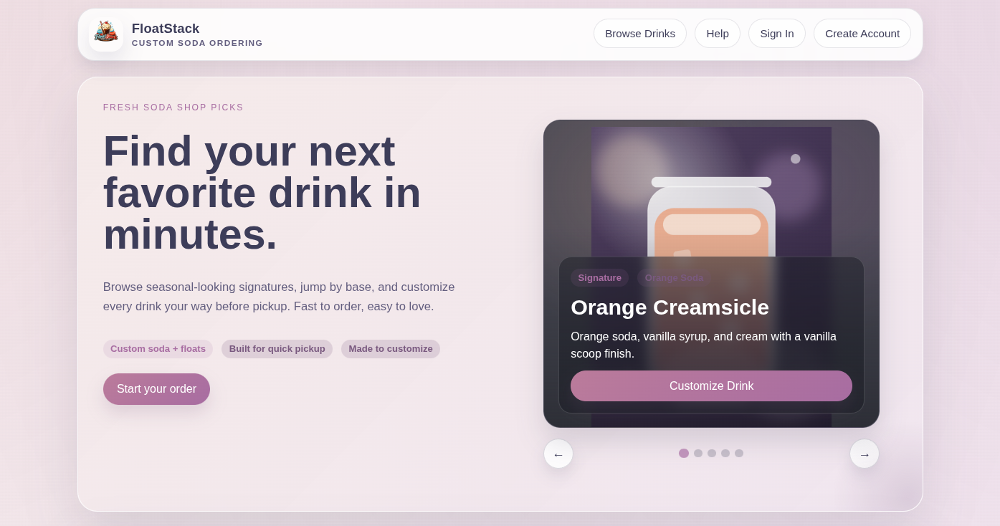

2. **Find a Store**
   - Click "Start your order" or go to `/stores/`

     > 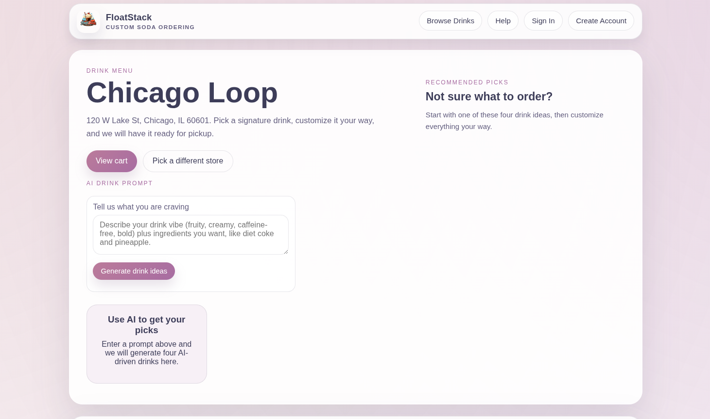

3. **Browse the Menu**
   - You're now in the drink menu for your chosen store
   - Use the "Generate drink ideas" box at top, or scroll down to see featured menu items as cards

     > 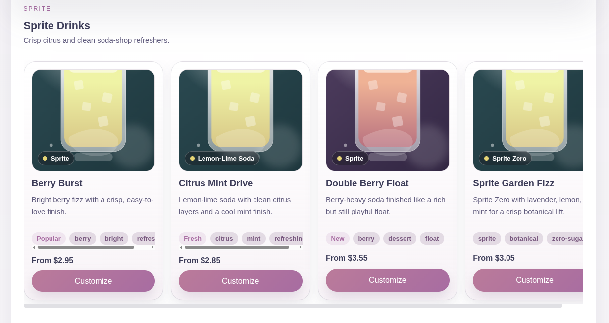

4. **Customize Your Drink** (see [Ordering as a Guest or Customer](#ordering-as-a-guest-or-customer) below)

### For New Account Users

**Creating an Account:**

1. Click **"Create Account"** at the top right, or go to `/register/`
2. Enter:
   - First name
   - Last name
   - Email address
   - Preferred store (or choose later)
   - Password (create a strong password)
   - Re-enter password to confirm
3. Click **"Create account"** at the bottom
4. Log in with your new email and password

> 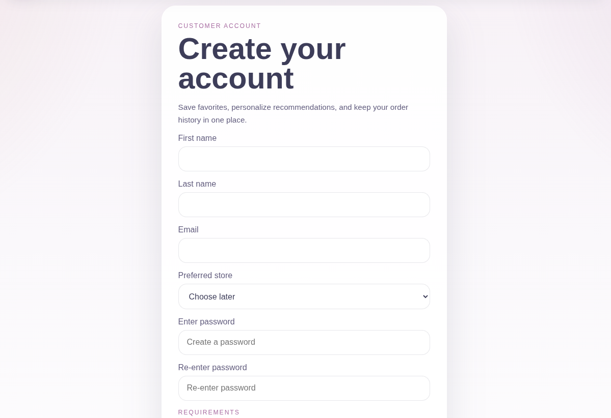

**Logging In:**

1. Click **"Sign In"** at the top right, or go to `/login/`
2. Enter your email and password
3. Click **"Sign in"** at the bottom
4. You'll be redirected to your account dashboard

> 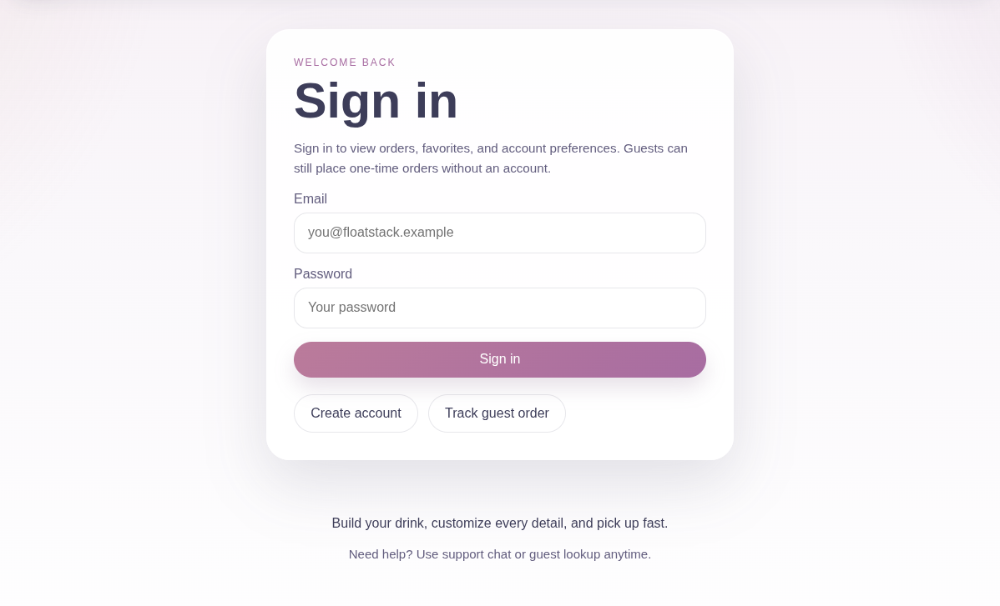

---

## Ordering as a Guest or Customer

### Step 1: Browse Stores

1. Start at `/stores/` (Click "Browse Drinks" to get to this page)
2. Click on a store to begin ordering

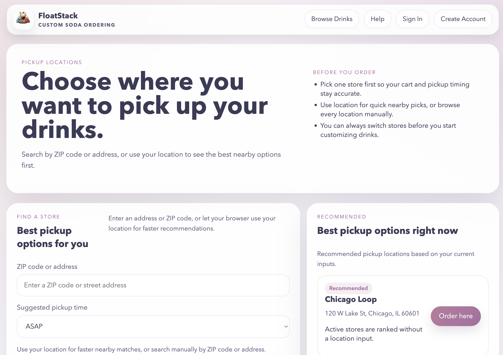

### Step 2: Browse the Menu

Once you've selected a store, you'll see the drink menu at `/orders/menu/<store>/`

**Menu sections:**

- **AI Drink Generation** — give the AI a prompts and it will create a drink based on that (shown towards top)
- **All menu items** — complete drink catalog, organized by type

**For each drink:**

- Name and price (prices vary by size: Small, Medium, Large)
- Badge (e.g., "Popular," "Signature," "New")
- Customization button

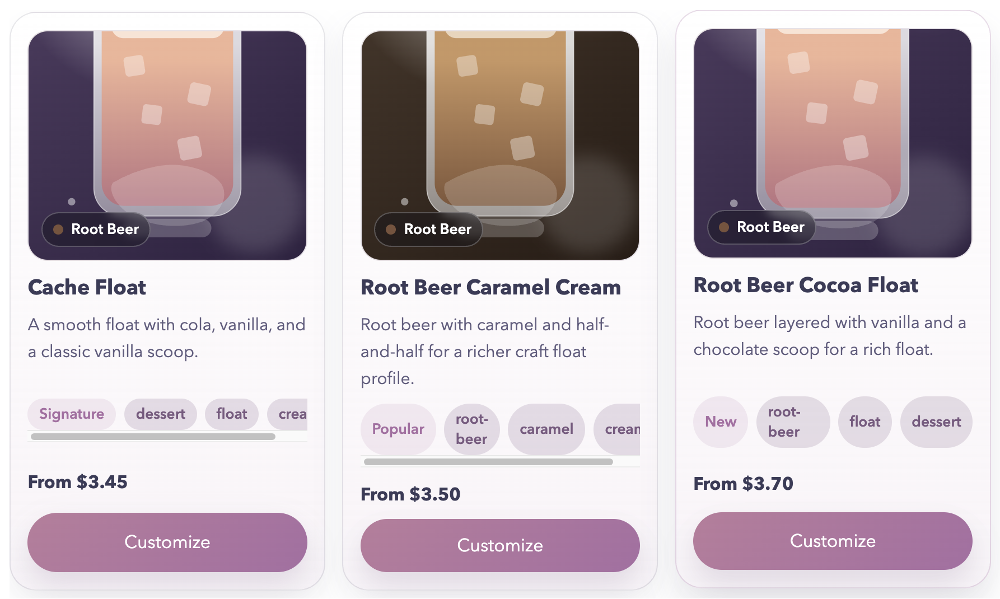

### Step 3: Use AI Assistance (Optional)

**For Account Users Only:** Save AI recommendations for future orders.
**For Guests:** Use the assistant but won't be able to save the build.

**Option A: AI Chat Assistant**

- Click in the "Tell us what you are craving" box on the menu
- Describe what you want in plain English (e.g., "I like fruity, sweet drinks")
- The assistant suggests flavor combinations once the "Generate drink ideas" button is selected
- Click a suggestion to add it to your cart or customize it

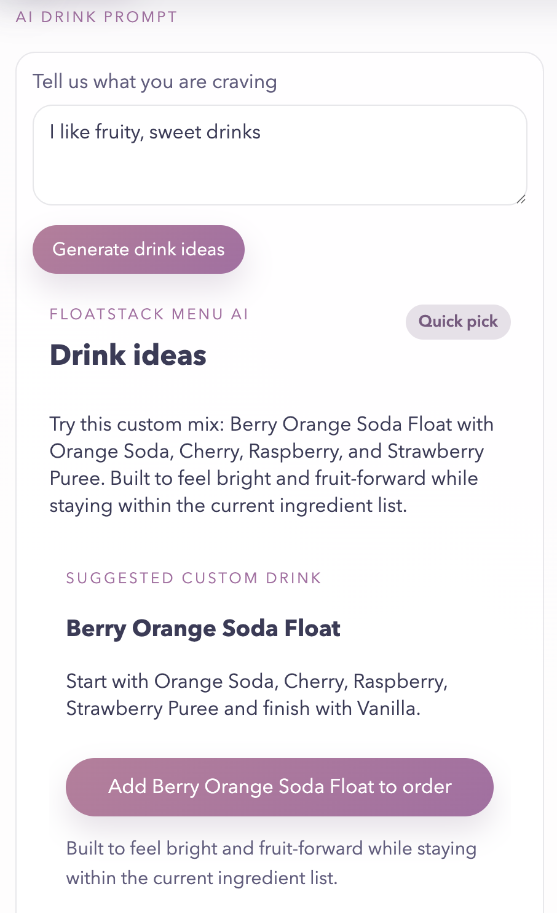

**Option B: Get Recommendations (Account Users)**

- Go to `/orders/recommendations/` (click the FloatStack logo in the top left of the page to access this page)
- AI personalizes suggestions based on your taste preferences
- Click a recommendation to customize further or add to cart

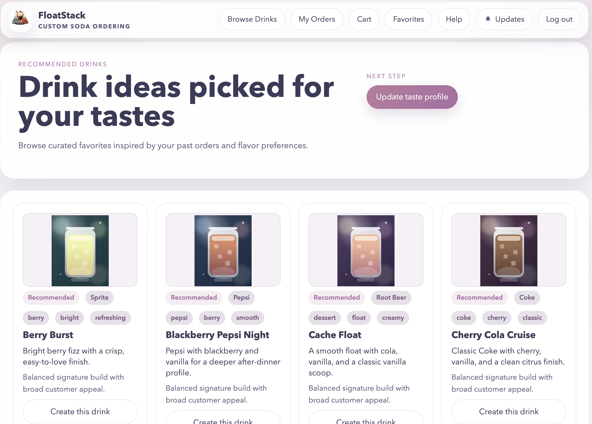

### Step 4: Customize Your Drink

Click on any drink to customize it:

1. **Choose a Size:** Small, Medium, Large (affects price)
2. **Pick a Base Soda** (required)
   - Examples: Coke, Sprite, Root Beer, Cream Soda, Mountain Dew, Pepsi
3. **Add Syrups** (optional, $0.25–$0.30 each)
   - Fruit: Strawberry, Cherry, Raspberry, Mango, etc.
   - Dessert: Caramel, Vanilla, Butterscotch, etc.
   - Citrus: Lime, Lemon, Orange, etc.
4. **Add Extras** (optional)
   - Cream, Whipped cream, Ice cream scoops
   - Fresh mint, citrus wedges
   - Purees
5. **Quantity and Pickup Notes** (optional text field)
   - Quantity
   - Any notes or allergies
6. **Review Price**
   - Total updates as you customize
7. Click **"Add to Order"**

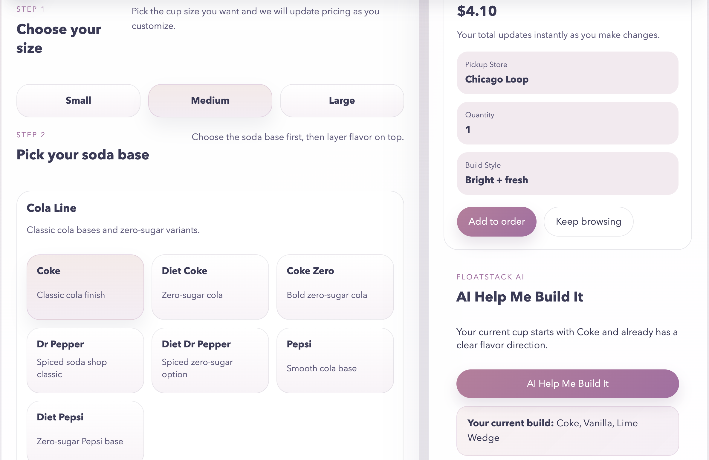

### Step 5: Review Your Cart

1. Go to your cart (you will be taken their after selecting add to order)
2. You'll see all items you've added
3. For each item:
   - View the customization summary (base, syrups, add-ins)
   - Click the quantity field to update how many
   - Click "Remove" to delete the item from cart
4. See your **subtotal** to the right
5. Click **"Checkout"**

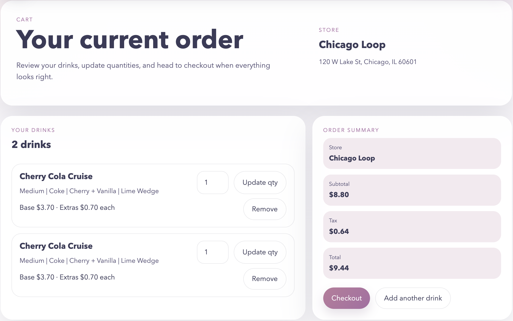

### Step 6: Checkout

1. **For Guests:** Enter your contact info
   - Full Name
   - Phone Number
   - Email Address (for order updates)

2. **For Account Users:** Logged-in info is already filled

3. **Review Order Total**
   - Subtotal of all items
   - Final total displayed

4. **Choose Payment Method** (if applicable)
   - Credit/debit card via Stripe (or demo mock payment)

5. Click **"Place Order"**

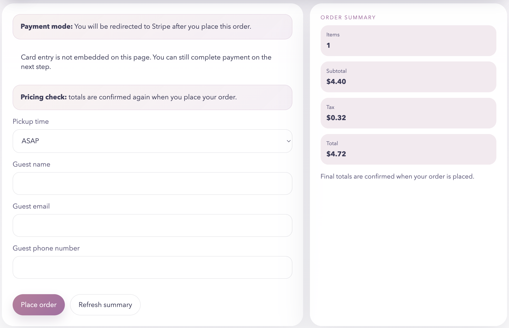

### Step 7: Order Confirmation

After checkout, you'll see your **order confirmation page** with:

- **Order Code** (e.g., `FS-M5K9TD`) — save this to look up your order later
- **Pickup Combo** (e.g., `624`) — staff uses this to identify your order
- **Requested Pickup Time**
- **Store Location**

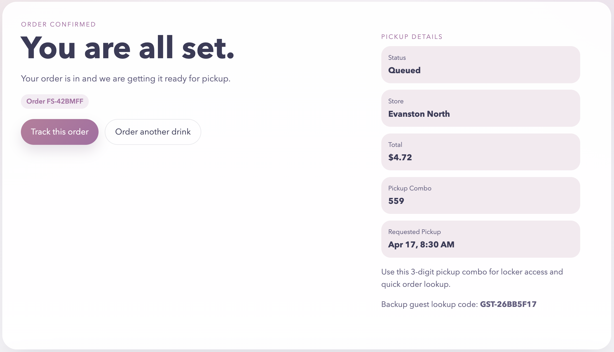

### Step 8: Track Your Order

**As a Guest:**

1. Go to `/orders/lookup/`
2. Enter your:
   - Order Code (e.g., `FS-M5K9TD`)
   - Pickup Combo (e.g., `624`)
   - Guest Lookup Code (provided in confirmation email)
3. Click "Look Up Order"
4. You'll see the current status (Queued, Preparing, Ready for Pickup, Picked Up)

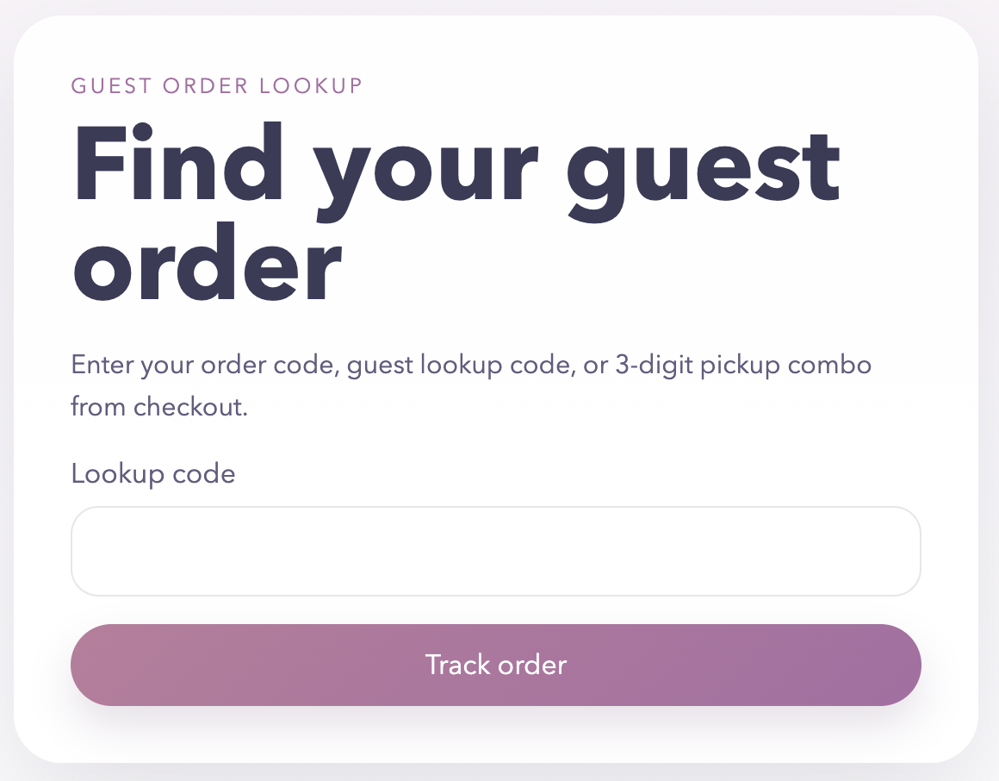

**As an Account User:**

1. Go to `/orders/history/` ("My Orders" button)
2. All your past and current orders are listed with status
3. Click on any order to see details

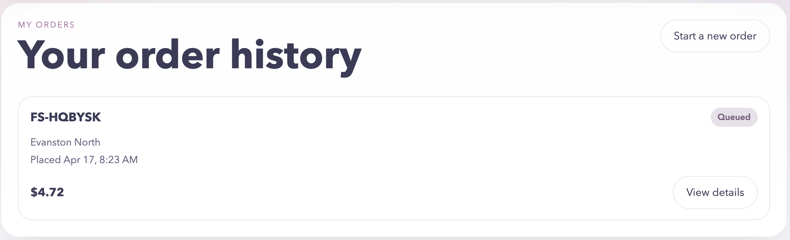

---

## Account Features

### Update Your Taste Preferences

Account users can customize recommendations by setting preferences:

1. Go to **Favorites** at `/orders/favorites/` or click **"Get drink ideas"** at `/orders/recommendations/`
2. Click **"Update taste profile"** to go to `/account/preferences/`
3. Set your preferences:
   - **Drinks** — choose preferred and avoided drinks
   - **Syrups** — select favorite and disliked syrups
   - **Add-ins** — choose preferred toppings
   - **Ice cream** — select favorite flavors
   - **Advanced filters** — dietary restrictions, sweetness preference (Light, Balanced, Sweet, Extra Sweet), and adventurousness (Classic, Balanced, Adventurous)
4. Click **"Save preferences"**

> 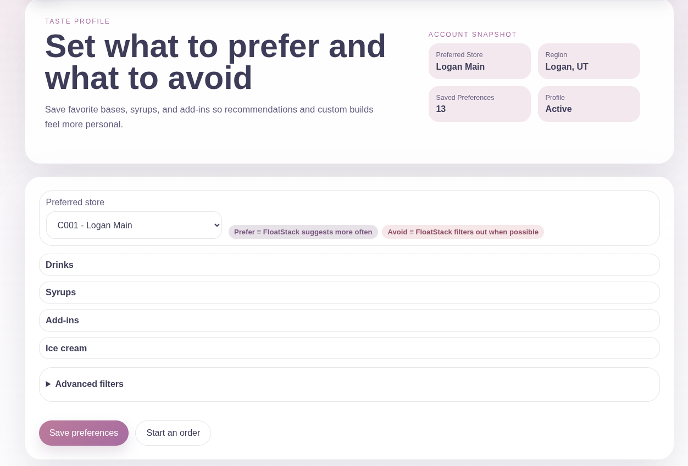

### Save Favorite Drinks

Save your perfect drink combinations for quick reorders:

1. Go to the drink menu (see "Ordering as a Guest or Customer" section) and customize a drink
2. At the very bottom of the customization page, scroll to **"Quantity and pickup notes"**
3. Check the checkbox **"Save this exact build as a favorite for faster reorders"**
4. Set your quantity and optional pickup notes
5. Click **"Add to Order"** — your build is saved

> 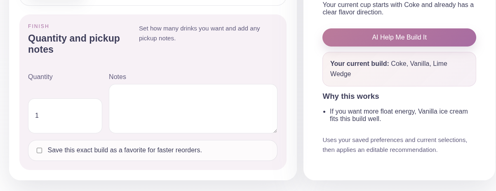

View your favorites anytime at `/orders/favorites/`:

- See all your saved custom drinks
- Click a favorite to add it to your cart (same customization applied)
- Click the trash icon to remove a favorite

> 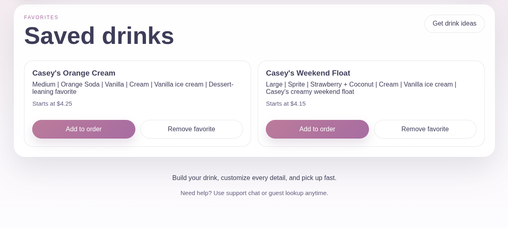

### Get Personalized Recommendations

Get AI-curated drink ideas based on your taste preferences and order history:

1. Log in and click **"Favorites"** in the navigation
2. Click **"Get drink ideas"** at the top right (under the nav bar)
3. Browse curated recommendations tailored to your tastes
4. Each recommendation shows:
   - The drink name and description
   - Why it matches your preferences
   - "Create this drink" button to customize it
5. Click **"Create this drink"** to customize and add to cart, or **"Update taste profile"** to refine your preferences

> 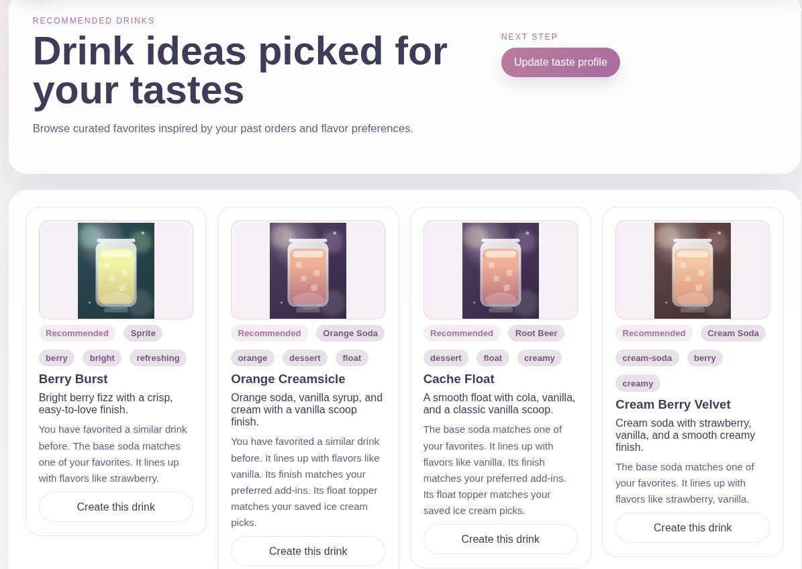

### View Order History

Track all your past and current orders:

1. Log in and click **"My Orders"** on the navigation bar
2. You'll see your order history with:
   - Order code (e.g., FS-Q7N4RX)
   - Store location
   - Date and time placed
   - Order total
   - Current status (Queued, Preparing, Ready, Picked Up)
3. Click **"View details"** on any order to see full customization details, items, and status

> 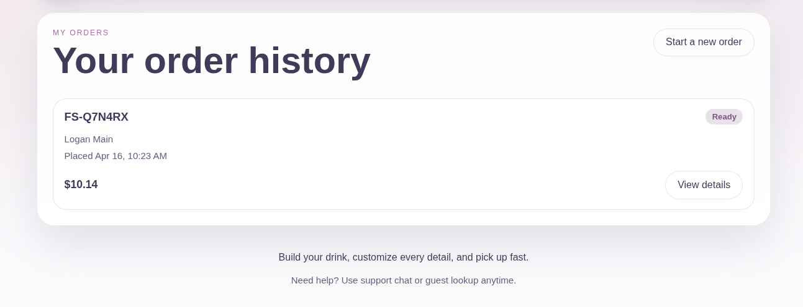

---

## Manager Workflow

### Accessing the Manager Dashboard

1. Log in with a manager account
2. After logging in, you'll be redirected to `/dashboards/manager/`

> 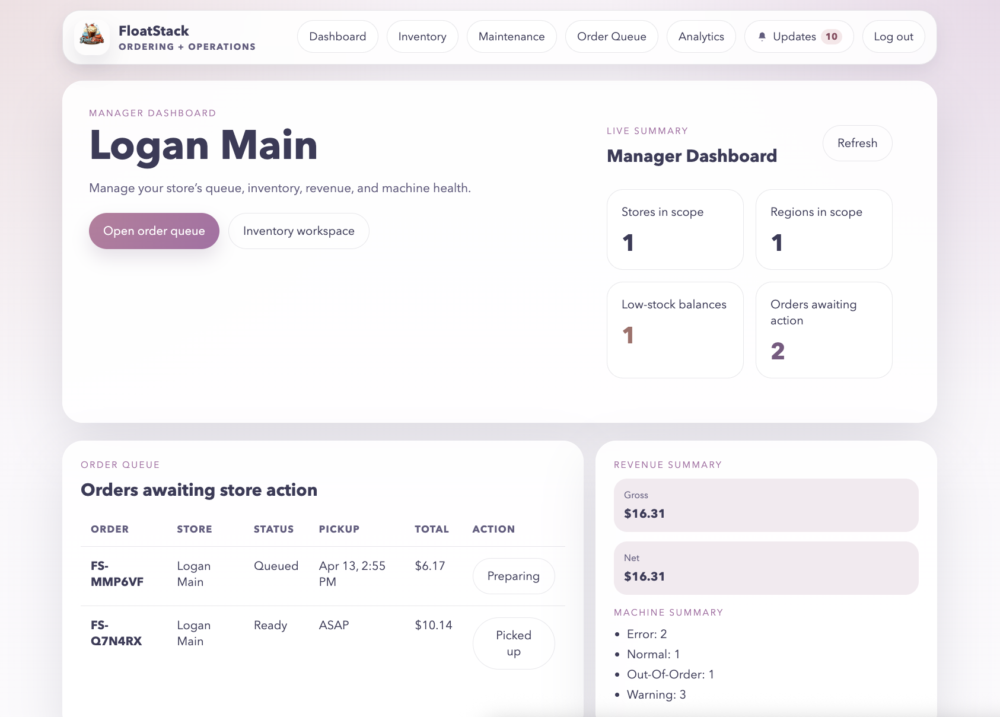

### View the Order Queue

1. From the manager dashboard, click **"Open order queue"** or go to `/orders/`
2. You'll see all orders for your store, grouped by status:
   - **Queued** — orders waiting to start
   - **Preparing** — orders being made
   - **Ready** — orders ready for pickup
   - **Picked Up** — completed orders

> 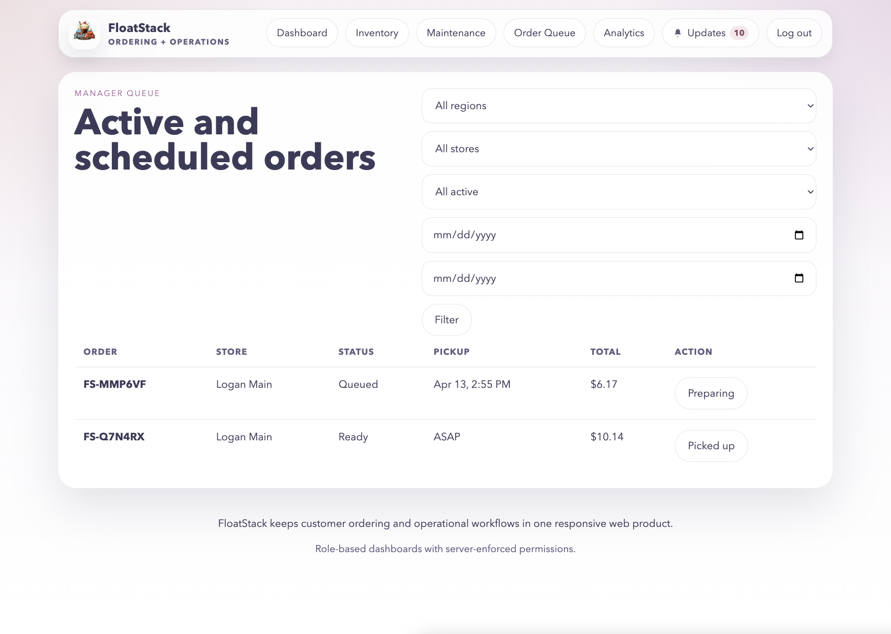

### Process an Order

1. Click on an order in the queue
2. Review the customizations and special requests
3. **Mark as Preparing:** Click "Start Preparing" when you begin making the drink
4. **Mark as Ready:** Click "Ready for Pickup" when complete
5. **Mark as Picked Up:** Click "Picked Up" when the customer takes the order

> 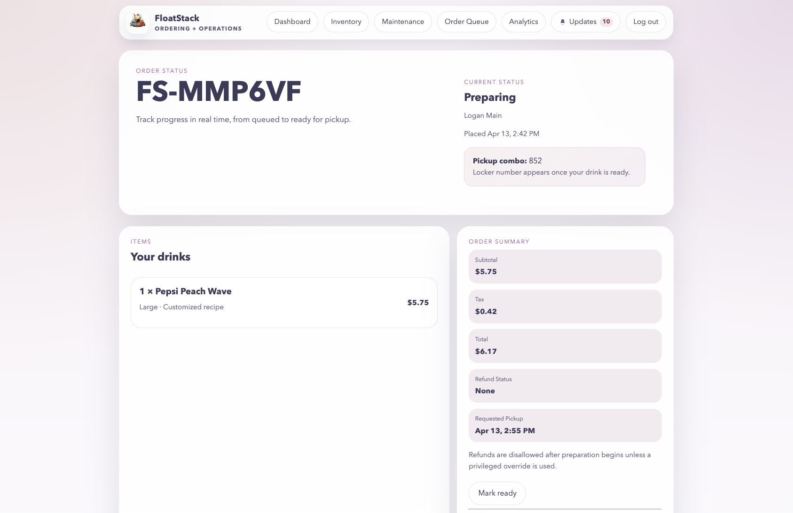

### Manage Inventory

1. From the manager dashboard, click **"Inventory"** or go to `/inventory/`
2. You'll see a table of all inventory items for your store with:
   - Item name and unit
   - On-hand quantity
   - Reserved quantity (allocated to orders)
   - Adjust button

> 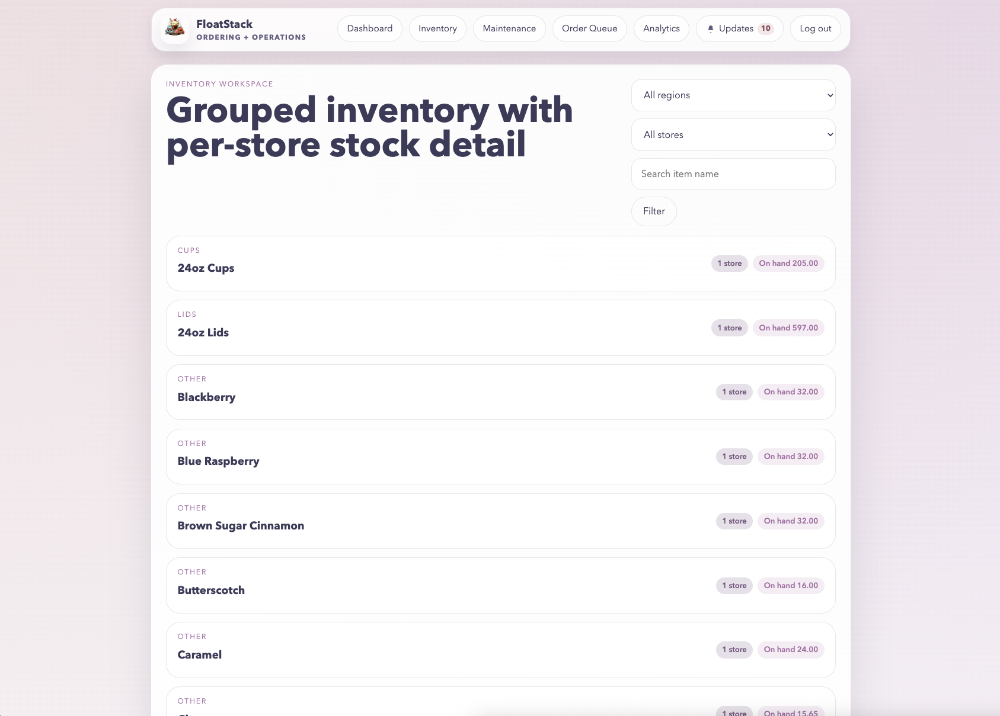

1. **Adjust Stock:**
   - Click on an item
   - Under the "Adjust" section of the item click into the field box to change the quantity or in the Amount field box
   - Enter the new on-hand count
   - Provide a reason for the adjustment
   - Click **"Save"** — the system updates immediately

> 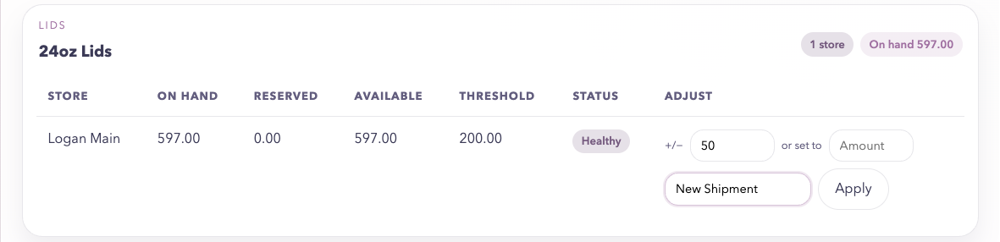

---

## Admin User Management

### Accessing the Admin Dashboard

1. Log in with an admin account
2. You'll be redirected to `/dashboards/admin/`

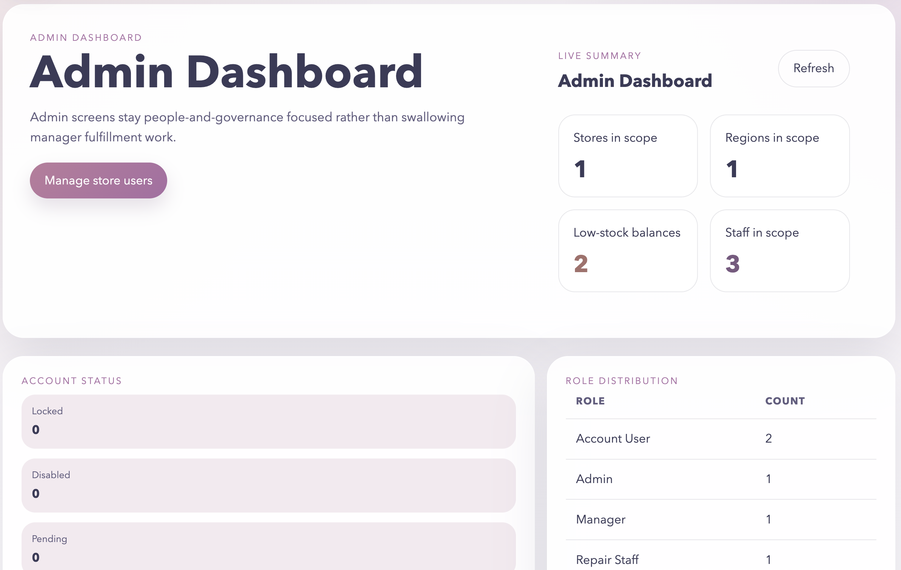

### Manage Users for Your Store

1. Go to `/admin/users/` (click on the "Team" button on the navigation bar at the top of the screen)
2. You'll see a list of all users assigned to your store

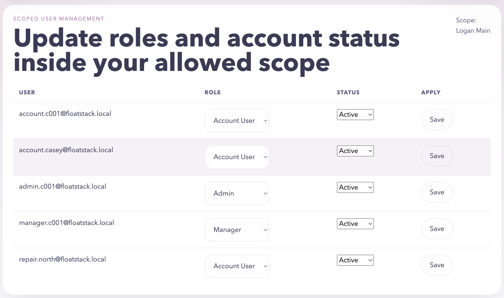

1. **Update a User:**
   - Click on a user in the list
   - Change their role(Account User, Manager, Admin) or status (Active, Locked, Disabled, pending)
   - Click **"Save"**

2. **Disable/Lock a User:**
   - Click on the user status
   - Change status to "Locked" or "Disabled"
   - Click **"Save"** — user can no longer log in

---

## Logistics Manager Workflow

### Accessing the Logistics Dashboard

1. Log in with a logistics manager account.
2. After signing in, you will be redirected to `/dashboards/logistics/`.
3. Use the dashboard to review supply activity, draft schedules, alerts, and regional inventory health.

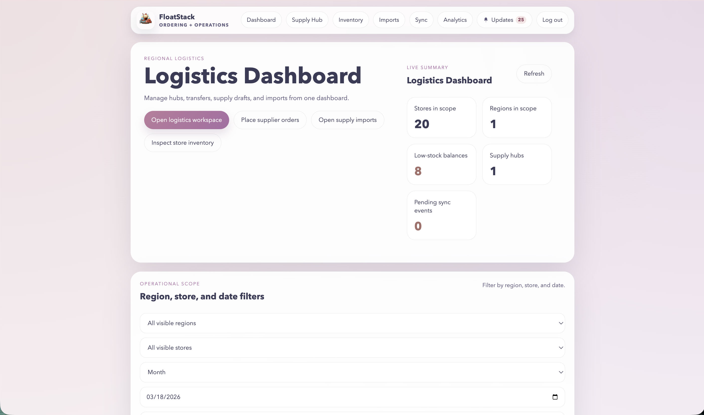

### Manage Supply Hubs

1. From the logistics dashboard, click **"Open logistics workspace"**, or go directly to `/supply-hubs/`.
2. The supply hub workspace is the main logistics operations page.
3. On this page, different sections let you create transfers, review transfer status, approve supply drafts, and manage supplier orders.
4. You may also see hub inventory and regional summary panels on the same workspace.

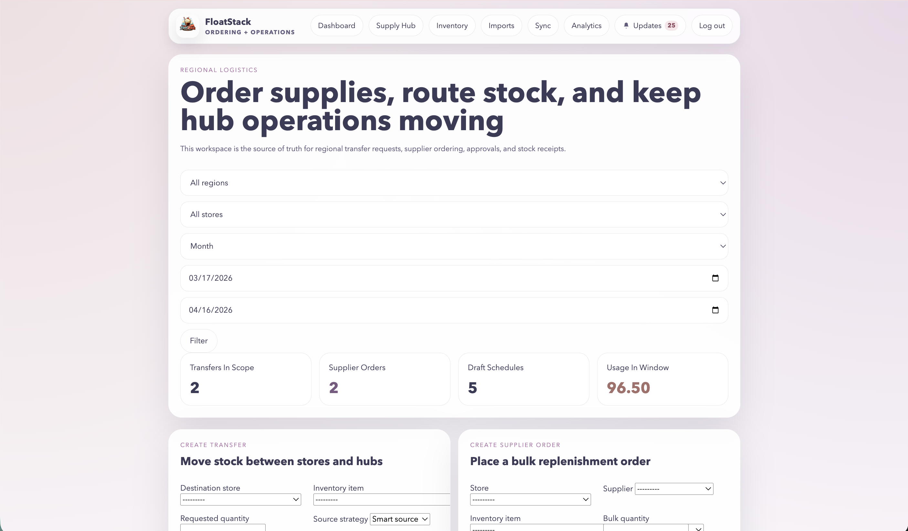

### Create a Supply Transfer

1. Open `/supply-hubs/`.
2. In the **Create Transfer** section, enter the transfer details.
3. Select the **destination store**.
4. Select the **inventory item**.
5. Enter the **requested quantity**.
6. Choose a **source strategy**:
   - Smart source
   - Specific store
   - Specific source hub
7. Add routing notes if needed.
8. Click **"Request transfer"**.

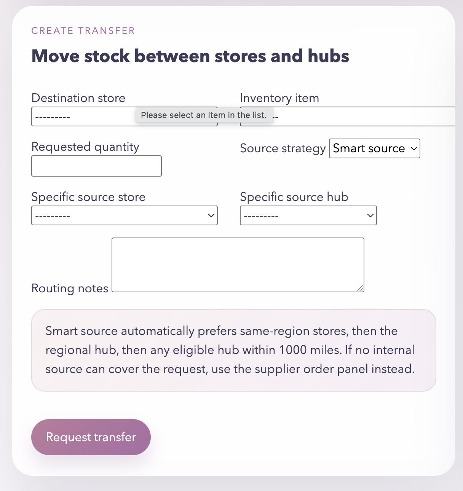

### Approve a Transfer

1. Open `/supply-hubs/`.
2. In the **Transfer Queue** section, locate the transfer request you want to review.
3. Review the destination, source, line items, current status, and available action.
4. Click the available action button, such as **"Approve"** or **"Reserve"**, depending on the transfer’s current state.

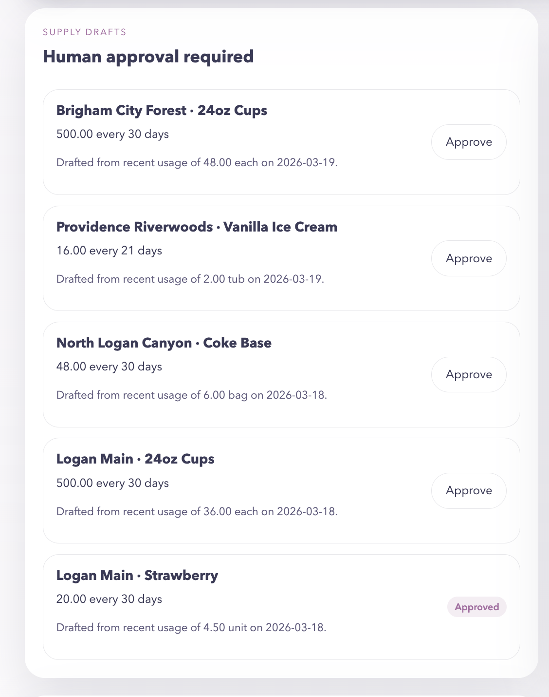

### Track Transfer Progress

Transfer progress is shown in the **Transfer Queue** section of `/supply-hubs/` using status labels and action buttons.

Transfer lifecycle:
1. **Requested** — the transfer request has been submitted.
2. **Approved** — the request has been approved.
3. **Reserved** — inventory has been set aside at the source.
4. **In Transit** — the shipment is on the way.
5. **Delivered** — the shipment has arrived at the destination.
6. **Received** — the destination has confirmed receipt.

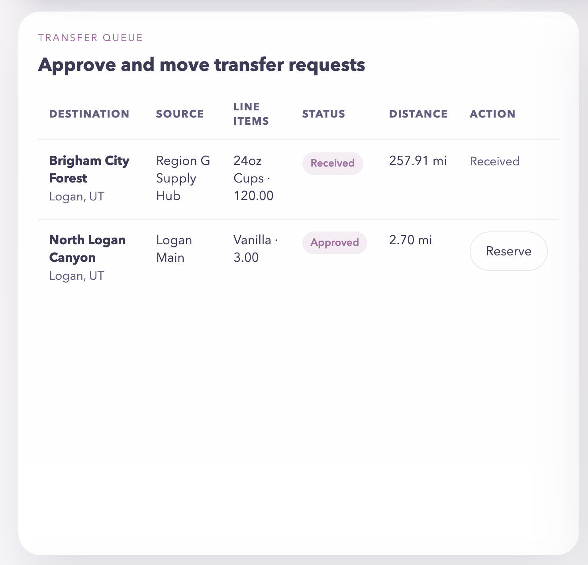

### Approve AI-Generated Supply Schedules

1. Open `/supply-hubs/`.
2. In the **Supply Drafts** section, review AI-generated schedule drafts created from usage activity.
3. Each row shows the store, item, quantity, and draft schedule timing.
4. Click **"Approve"** to approve a draft.

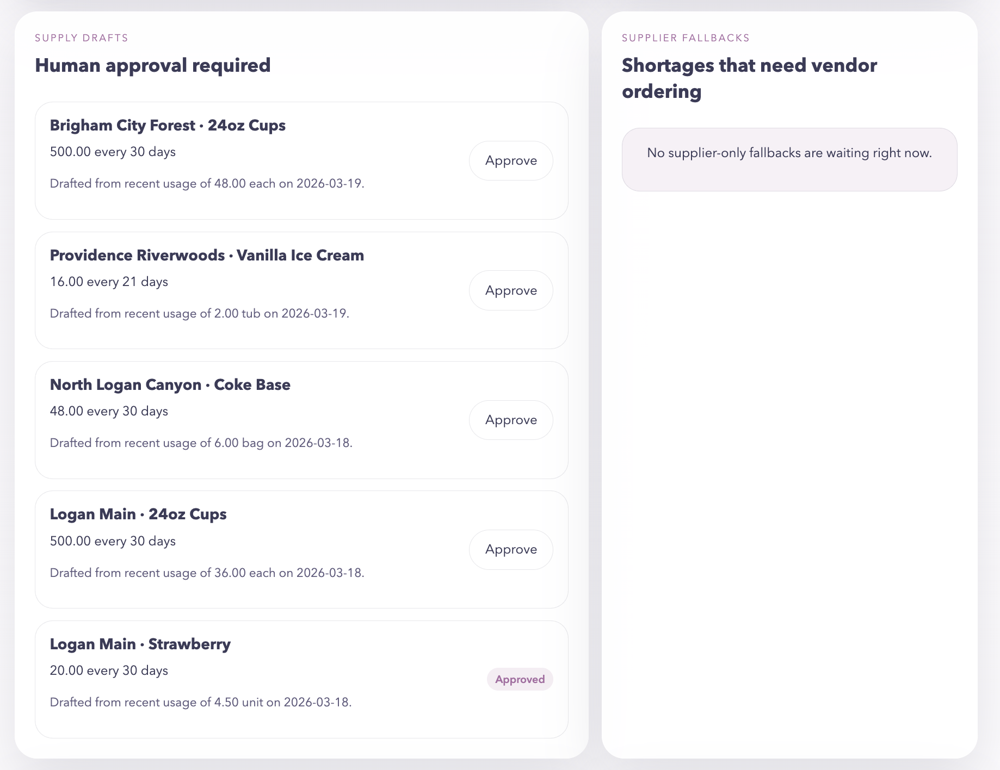

### Manage Supplier Orders

1. Open `/supply-hubs/`.
2. Use the **Create Supplier Order** section to place a new bulk replenishment order.
3. Enter the store, supplier, inventory item, quantity, expected delivery date, unit cost, and optional notes.
4. In the **Supplier Orders** section, review existing supplier orders and use actions such as **"Receive"** or **"Cancel"** when available.

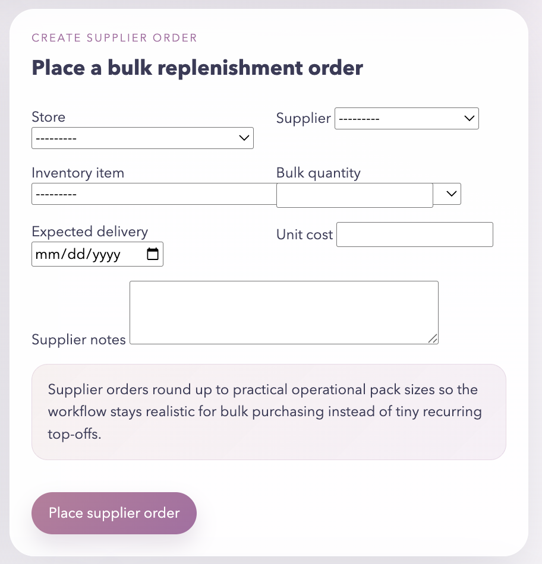

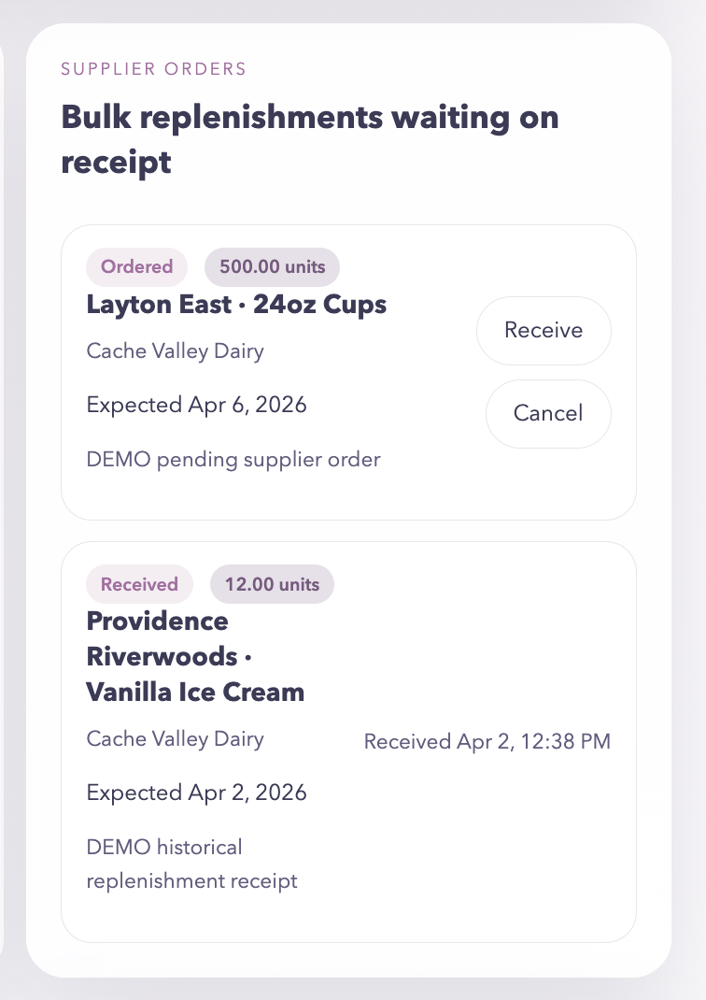

### Upload CSV Imports (Supply Usage)

1. Go to `/imports/`.
2. In the **Supply usage CSV** section, choose your file.
3. Click **"Import supply usage CSV"**.
4. Use these exact CSV column headers:
   - `store_code`
   - `inventory_sku`
   - `usage_date`
   - `quantity_used`
5. After upload, review the import history and any validation errors shown on the page.

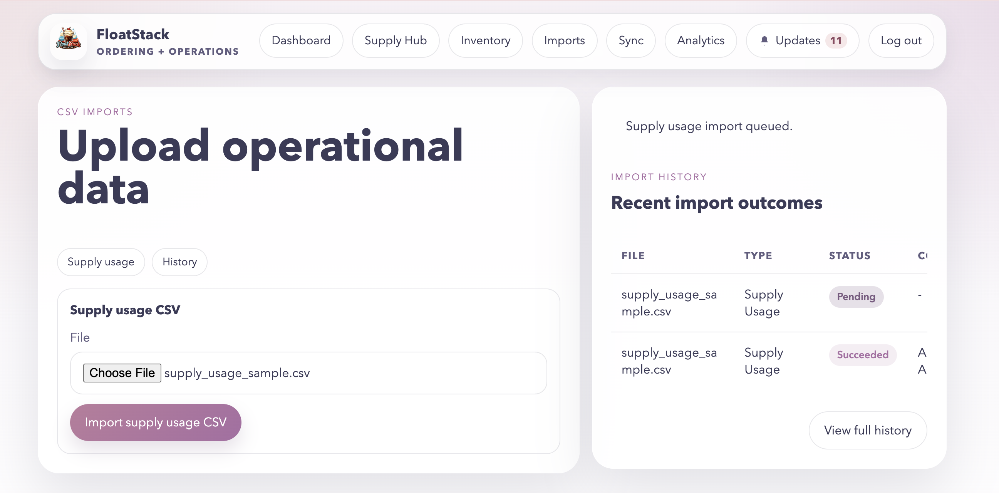

### View Analytics

1. Go to `/analytics/`.
2. Use the analytics page to review operational data across stores and regions.
3. Reports may include inventory trends, usage activity, and supply health metrics.

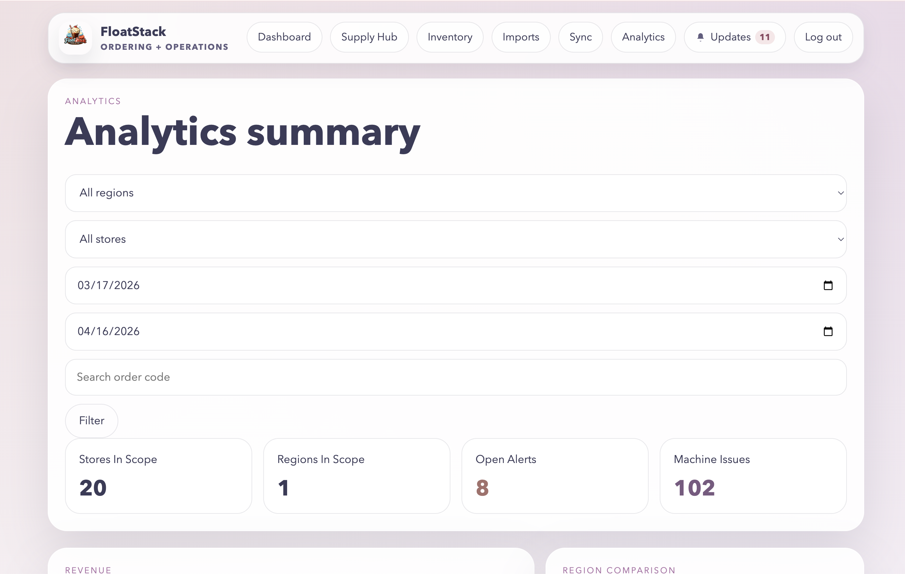

---

## Repair Staff Workflow

### Accessing the Repair Dashboard

1. Log in with a repair staff account
2. After sign-in, you should land on the **Repair Dashboard**
3. Confirm the top navigation includes **Dashboard**, **Maintenance**, and **Imports**

> 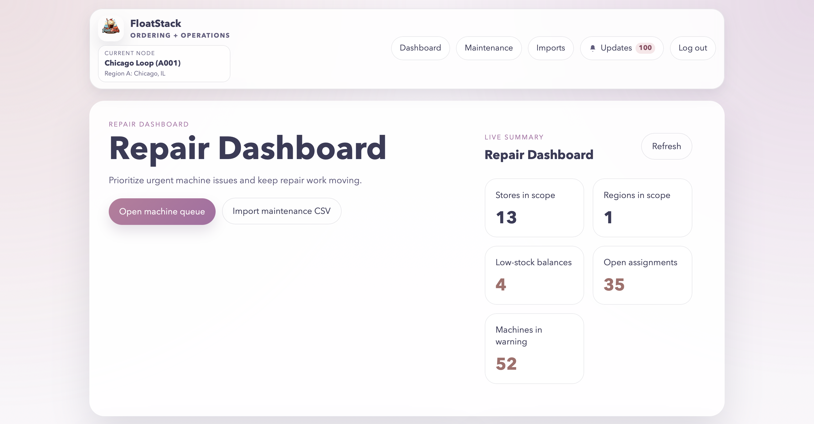

### View Maintenance Assignments

1. Open **Maintenance** from the top navigation (or click **Open machine queue** on the dashboard)
2. In the maintenance workspace, review:
   - **Urgent Queue** — machines needing immediate service
   - **Route-Aware Queue** — grouped city/route batches for dispatch planning
   - **Repair Assignments** — active and recent tasks assigned to you

> 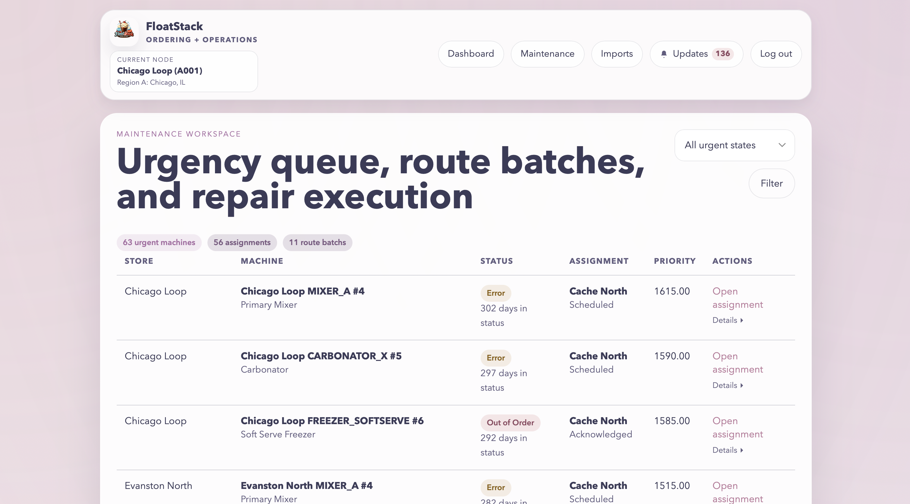

### Complete a Repair Assignment

1. In **Repair Assignments**, open the assignment card you are working
2. Confirm key details:
   - Store and machine
   - Assignment and machine status
   - Route batch and latest activity notes
3. Add an update note if needed in the note box
4. Use the appropriate action button for the current state:
   - **Acknowledge**
   - **Start repair**
   - **Save update**
   - **Block**
   - **Complete**
   - **Close assignment** (when available)
5. Confirm the card updates and your latest activity appears in the assignment history line

> 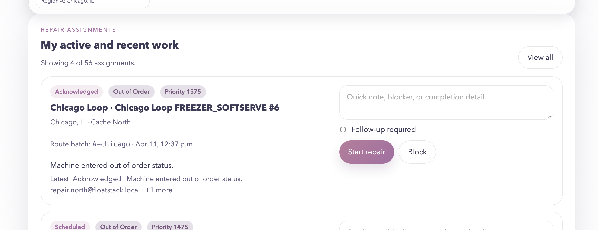

### Upload CSV Imports (Repair Status)

1. Open **Imports** from the top navigation (or click **Import maintenance CSV** on the repair dashboard)
2. In the imports workspace, use the **Maintenance status CSV** card
3. Choose your CSV file and click **Import maintenance CSV**
4. Use the required header row exactly:
   - `store_address,machine_type_code,machine_operational_from_date,machine_status,status_date`
5. Confirm the job result in import history (queued, succeeded, or failed with validation details)

> 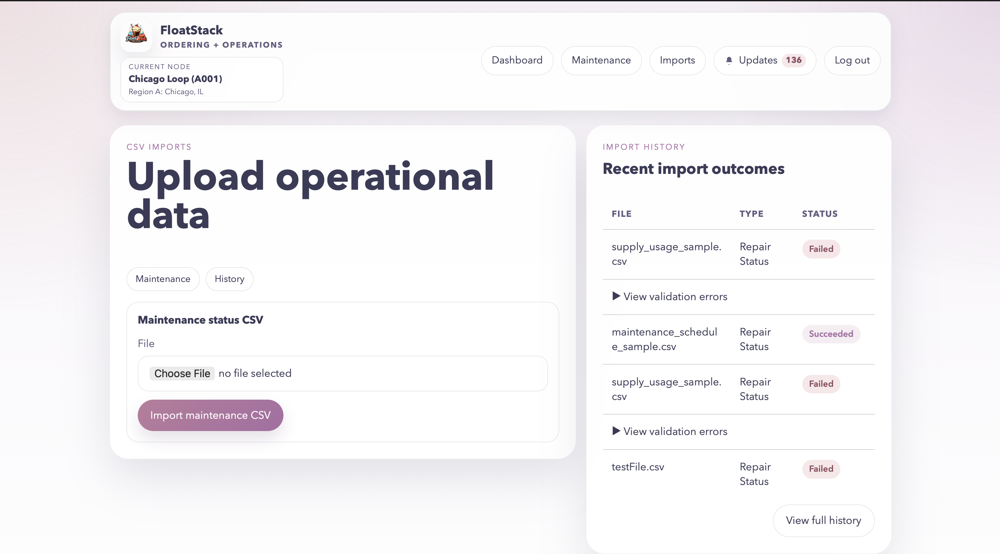

---

## Super Admin System Overview

### Accessing the Super Admin Dashboard

1. Log in with a super admin account
2. You'll be redirected to `/dashboards/super-admin/`

> 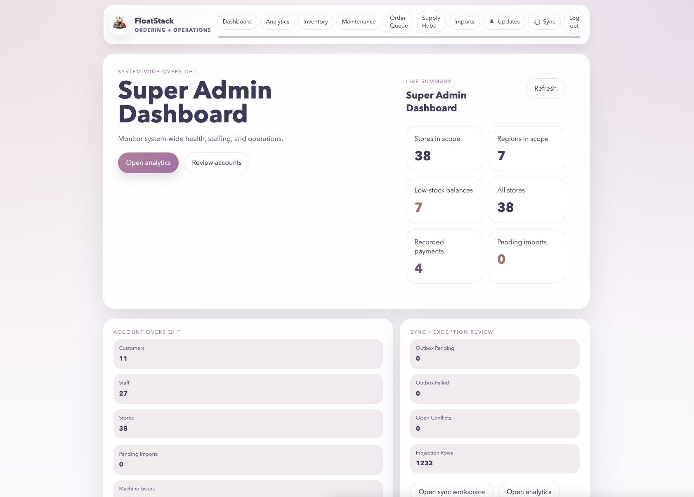

### Monitor System Health

1. From the super admin dashboard, you have access to:
   - **Full Analytics** — revenue, usage, machine health across all stores and regions
   - **Sync Status** — real-time view of data synchronization between stores
   - **User Oversight** — all users, their roles, store assignments
   - **Audit Logs** — record of staff actions for compliance

2. Go to `/sync/` to view:
   - Pending sync events
   - Failed sync attempts
   - Conflict resolution status

> 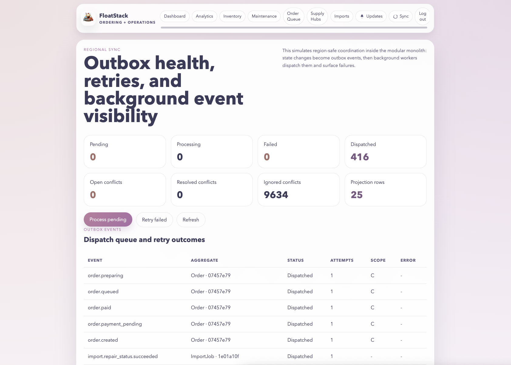

### Manage System Users

1. Go to admin panel and use user management tools
2. Create, edit, or disable any user across all stores
3. Assign users to stores or regions
4. Set roles and permissions

---

## Getting Support

### Start a Support Conversation

1. Go to `/support/`.
2. The support page opens your current support chat.
3. Click **"Start new chat"** if you want to reset the conversation and begin a new thread.
4. Type your question in the **Message** box.
5. Click **"Send message"**.

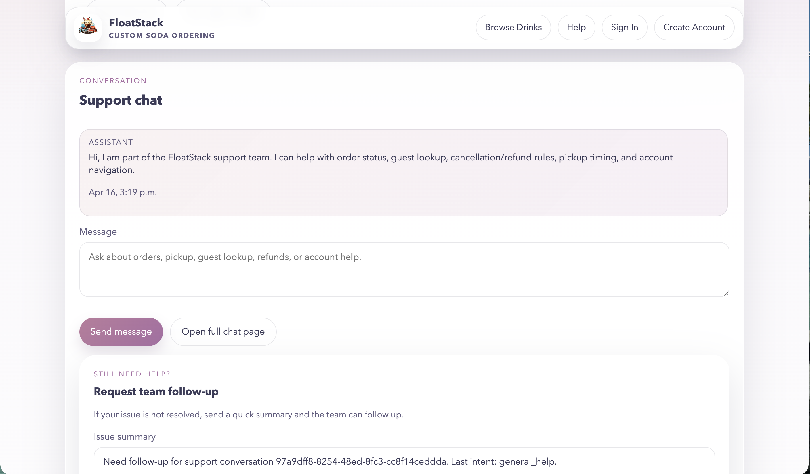

### Request Team Follow-Up

If your issue still is not resolved:

1. Stay on the support page or open the full chat view.
2. In the **Request team follow-up** section, enter a short summary of the issue.
3. Add a contact email if needed.
4. Click **"Send follow-up request"**.

---

## Troubleshooting

### Common Issues and Solutions

**"I forgot my password"**

- Click "Forgot Password?" on the login page
- Enter your email
- Check your email for a password reset link

**"My order status isn't updating"**

- Refresh the page (browser refresh or press F5)
- If ordering as a guest, verify you're using the correct order code and guest lookup code

**"I can't add a drink to my cart"**

- Ensure you've completed all required fields (size, base soda)
- Check that you've selected a valid store
- Clear your browser cache and try again

**"Inventory adjustment didn't save"**

- Verify you have manager or admin permissions
- Ensure the new quantity is a valid number
- Check your internet connection and retry

**"My AI recommendation won't save"**

- Account users can save recommendations — are you logged in?
- Check that your account is active and not locked

**"I received an error during checkout"**

- Verify all form fields are filled correctly
- Check your internet connection
- Try a different browser or clear cache

**"Supply transfer is stuck in 'Approved' status"**

- Confirm the source has sufficient inventory reserved
- Check if destination location has space for the items
- Retry the transfer operation

**"My payment was declined or failed"**

- Double-check your card number, expiration date, and CVV
- Try a different payment method
- Contact your bank if the issue persists — your order code is preserved and you can retry payment from your order detail page

**"My Stripe checkout session expired"**

- This happens if the Stripe payment page was left open too long without completing
- Go back and click "Place Order" again to start a new checkout session
- Complete payment promptly once the Stripe page opens

**"My order is stuck on 'Payment Pending'"**

- Refresh the page — the system checks payment status automatically
- If the status doesn't update after a few minutes, try navigating back to your order detail page using your order code
- If the problem continues, use the in-app support chat at `/support/`

**"The checkout form won't submit"**

- Name field cannot be blank or only spaces
- Email must be a valid format (e.g., `name@example.com`)
- Phone number must contain at least 10 digits
- All three fields are required for guest checkout — verify each one is filled in correctly

**"The pickup time I selected shows an error"**

- This happens if the page was open for a long time and the time slot is no longer in the future
- Refresh the page to load updated pickup time options and reselect

**"FloatStack can't find my location"**

- If you typed an address or ZIP code, make sure it is a valid US address
- Try entering just a ZIP code rather than a full street address
- If the issue continues, allow browser location access or manually select a store from the list

---

## FAQs

**Q: Can I order as a guest without creating an account?**
A: Yes. Guests can browse stores, customize drinks, and checkout without an account. You'll receive an order code to look up your order later.

**Q: How do I save my favorite drink combination?**
A: Create an account, customize your drink, and check "Save as Favorite" before adding to cart. You can later quickly add it again from your favorites list.

**Q: How long does drink preparation take?**
A: Estimated times vary by store and current queue. You'll see the estimate on your confirmation page. Typical preparation is approximately 12–15 minutes from the time you order.

**Q: Can managers see all stores' orders or just their own?**
A: Managers see orders for their assigned store only. Super admins and logistics managers have cross-store visibility.

**Q: How do I know if an inventory item is low?**
A: The system alerts managers and logistics coordinators when inventory drops below configurable thresholds. Restock alerts appear in the logistics dashboard.

**Q: Can I cancel my order?**
A: Yes, if the order hasn't started being prepared. Go to your order detail page and click "Cancel Order." Refunds are processed according to the payment method.

**Q: What happens if I order something that runs out of stock?**
A: The system prevents ordering items that are out of stock. If an item is allocated to your order but runs out during preparation, staff will contact you to suggest alternatives.

**Q: How do supply transfers work?**
A: Transfers move inventory from one store/hub to another. Logistics managers create requests, approvals are made, items are reserved, shipped, and delivered between locations.

**Q: Can repair staff work on machines outside their assigned region?**
A: Repair staff are assigned to specific regions and stores. Cross-region assignments require super admin or logistics manager coordination.

**Q: Where can I see my entire order history?**
A: Account users can go to `/orders/history/` to see all past and current orders.

**Q: How does FloatStack recommend a store near me?**
A: On the store selection page at `/stores/`, you can type a ZIP code or street address to find nearby locations. You can also click "Use My Location" to allow browser location access. FloatStack ranks stores by distance and, for logged-in users, also factors in your preferred store. If no location is provided, stores are listed alphabetically.

**Q: What if my location can't be found?**
A: If FloatStack can't resolve the address you typed, you'll see a message: "We couldn't place that location yet." Try entering just your ZIP code, use your device's location instead, or scroll down to browse all stores manually and select one.

**Q: Can I choose what time to pick up my order?**
A: Yes. During checkout you can select a pickup time. The default is "ASAP" (approximately 12 minutes from when you order), and the system also suggests two additional time slots spaced 15 minutes apart. You can select whichever works best for you.

**Q: Where exactly do I pick up my order?**
A: Your order confirmation page shows the store address and any locker number or pickup code assigned to your order. Bring your order code or pickup combo and show it to staff, or use the locker code if your store has lockers.

**Q: Can I order more than one of the same drink?**
A: Yes. On the customization page, set the quantity up to 12 per drink. You can also add the same drink multiple times from the menu and adjust quantities in your cart before checkout.

**Q: What is the difference between the AI assistant and recommendations?**
A: The AI chat assistant (available to guests and account users) lets you describe what you're in the mood for and suggests a drink build. Recommendations at `/orders/recommendations/` are available to account users only and are personalized based on your saved taste preferences and order history. Only account users can save AI-suggested builds to their favorites.

---

## Contact & Feedback

For support issues, bugs, or feature requests:

- **In-App Support (Primary):** Use **Help** in the app to start a support conversation and submit a follow-up request.
- **Demo Escalation Email (Demo Only):** `support@floatstack.demo` (for presentation/testing use; not a production inbox).
- **Repair Staff Operational Issues:** Report through your manager/super admin workflow and include store, machine, assignment context, and screenshots.
- **Bug Reports / Feature Feedback:** Submit through your team’s standard tracker with clear reproduction steps and expected vs actual behavior.

---

## Appendix: Demo Credentials

For testing or onboarding:

| Role              | Email                            | Password         |
| ----------------- | -------------------------------- | ---------------- |
| Customer          | `account.casey@floatstack.local` | `FloatStack123!` |
| Customer          | `account.river@floatstack.local` | `FloatStack123!` |
| Manager           | `manager.c001@floatstack.local`  | `FloatStack123!` |
| Admin             | `admin.c001@floatstack.local`    | `FloatStack123!` |
| Logistics Manager | `logistics.c@floatstack.local`   | `FloatStack123!` |
| Repair Staff      | `repair.north@floatstack.local`  | `FloatStack123!` |
| Super Admin       | `superadmin@floatstack.local`    | `FloatStack123!` |

**Demo Guest Order Lookup:**

- Order Code: `FS-M5K9TD`
- Pickup Combo: `624`
- Guest Lookup Code: `GST-DEMO-001`

---

**End of User Manual (Draft)**

---

## Notes on Documentation Inconsistencies Found

The following inconsistencies between the High-Level Design (HLD) / Low-Level Design (LLD) docs and the actual codebase should be addressed:

1. **"general_user" role does not exist** — Both HLD and LLD describe a `general_user` role separate from `account_user`. The actual code has no such role. Guest behavior is handled via session-based carts and `GuestOrderContact` model. This manual uses "guest" instead of "general_user" to match the code.

2. **LLD URL namespace inconsistency** — LLD shows `/users/...` as URL prefix. Actual routes are at root (`/login/`, `/register/`, `/dashboard/`). Corrected in this manual.

3. **Order workspace role access** — LLD implies all staff can access `/orders/` queue. Code restricts access to `manager` and `super_admin` only. Clarified in the manager section.

4. **AI save functionality** — Guests can use the AI assistant chat but cannot save results. Only account users can save recommended builds. Noted in the "Account Features" section.

**Recommendation:** Align HLD/LLD documentation with the actual code to prevent future confusion during handoff or maintenance.
