# CodePop – Low-Level Design Document
## Table of Contents

- [Section 1 - Introduction](#section-1---introduction)
  - [1.1 Purpose](#11-purpose)
  - [1.2 Scope](#12-scope)
  - [1.3 Definitions & Acronyms](#13-definitions--acronyms)
- [Section 2 – System Architecture](#section-2--system-architecture)
  - [Preface](#preface)
  - [Architectural Decision: Standardize on Django + HTMX (Web-Based Frontend)](#architectural-decision-standardize-on-django--htmx-web-based-frontend)
  - [2.1 Architectural Pattern](#21-architectural-pattern)
  - [2.1.1 Technology Stack](#211-technology-stack)
  - [2.2 Project Structure (Django)](#22-project-structure-django)
  - [2.3 Design Patterns Used](#23-design-patterns-used)
  - [2.4 API Design Conventions](#24-api-design-conventions)
  - [2.5 Deployment Design](#25-deployment-design)
  - [2.6 Django Admin Interface](#26-django-admin-interface)
  - [2.7 Architecture Diagram](#27-architecture-diagram)
- [Section 3 - User Management & Security](#section-3---user-management--security)
  - [3.1 Architectural Overview](#31-architectural-overview)
  - [3.2 User Model Design](#32-user-model-design)
  - [3.3 Role-Based Access Control (RBAC)](#33-role-based-access-control-rbac)
  - [3.4 Authentication Strategy](#34-authentication-strategy)
  - [3.5 Password and Credential Security](#35-password-and-credential-security)
  - [3.6 Stripe Payment Security](#36-stripe-payment-security)
- [Section 4 - Order & Payment System Design](#section-4---order--payment-system-design)
  - [4.1 Overview](#41-overview)
  - [4.2 Order Lifecycle State Machine](#42-order-lifecycle-state-machine)
  - [4.3 Data Models](#43-data-models)
  - [4.4 Endpoints and Internal APIs](#44-endpoints-and-internal-apis)
  - [4.5 Frontend Order Flow](#45-frontend-order-flow)
  - [4.6 Refund Processing](#46-refund-processing)
  - [4.7 Order Expiration](#47-order-expiration)
  - [4.8 Sequence Diagram — Complete Order Flow](#48-sequence-diagram--complete-order-flow)
- [Section 5 — Supply Hub & Inventory Management](#section-5--supply-hub--inventory-management)
  - [5.1 Overview](#51-overview)
  - [5.2 Module Components](#52-module-components)
  - [5.3 Data Models](#53-data-models)
  - [5.4 Key Business Logic](#54-key-business-logic)
  - [5.5 Views and Endpoints](#55-views-and-endpoints)
  - [5.6 Logistics Manager Dashboard](#56-logistics-manager-dashboard)
  - [5.7 Granular Implementation Plan](#57-granular-implementation-plan)
  - [5.8 Definition of Done](#58-definition-of-done)
  - [5.9 Acceptance Test Checklist](#59-acceptance-test-checklist)
- [Section 6 - Machine Maintenance & Repair Scheduling](#section-6---machine-maintenance--repair-scheduling)
  - [6.1 Purpose](#61-purpose)
  - [6.2 Data Models](#62-data-models)
  - [6.3 Core Services and Responsibilities](#63-core-services-and-responsibilities)
  - [6.4 APIs (Internal Endpoints)](#64-apis-internal-endpoints)
  - [6.5 Decentralized / Regional Sync Considerations](#65-decentralized--regional-sync-considerations)
- [Section 7 - Data Layer](#section-7---data-layer)
  - [7.1 Database Schema](#71-database-schema)
  - [7.2 Synchronization Architecture](#72-synchronization-architecture)
  - [7.3 Conflict Resolution](#73-conflict-resolution)
  - [7.4 Offline Handling](#74-offline-handling)
  - [7.5 Data Integrity Rules](#75-data-integrity-rules)
- [Section 8 - Integrations](#section-8---integrations)
  - [8.1 Stripe Integration](#81-stripe-integration)
  - [8.2 Push Notifications](#82-push-notifications)
  - [8.3 Geolocation Services](#83-geolocation-services)
  - [8.4 CSV Interface (Supply Usage)](#84-csv-interface-supply-usage)
  - [8.5 CSV Interface (Repair / Machine Maintenance)](#85-csv-interface-repair--machine-maintenance)
- [Section 9 - Seed Data, Testing, and Implementation Guardrails](#section-9---seed-data-testing-and-implementation-guardrails)
  - [9.1 Required Seed Data](#91-required-seed-data)
  - [9.2 Test Strategy Summary](#92-test-strategy-summary)
  - [9.3 Codex Guardrails](#93-codex-guardrails)
- [Section 10 - Conclusion](#section-10---conclusion)

---

## Section 1 - Introduction

### 1.1 Purpose

This Low-Level Design (LLD) document translates the approved high-level design into implementation-ready details for **CodePop**, a distributed, multi-store beverage ordering and operations platform.

At the low level, this document defines:

- Django app boundaries
- database models
- state transitions
- role-permission enforcement
- endpoint shapes
- synchronization scope
- CSV import rules
- inventory movement rules
- repair scheduling behavior
- dashboard behavior
- test data expectations

> **Plain-English summary:** the HLD says *what* the system is. This document says *how to build it without making weird guesses*.

### 1.2 Scope

This LLD covers the course-project implementation of CodePop, which is built on top of a provided web application and extended to support:

- many stores across the United States,
- region-aware logistics,
- seven supply hubs,
- repair scheduling by assigned repair staff,
- account-based and guest ordering,
- store-scoped operational authority,
- regional synchronization of non-sensitive operational data,
- CSV-based supply usage analysis,
- CSV-based machine maintenance import,
- dashboards for `manager`, `admin`, `logistics_manager`, `repair_staff`, and `super_admin`.

This document intentionally supports **two truths at once**:

| Perspective | Meaning |
|---|---|
| Real-world target architecture | Stores and hubs operate as independent nodes communicating with each other by region and approved synchronization rules. |
| Course implementation | The distributed model is simulated inside one Django codebase using store-scoped and region-scoped data, permissions, and sync services. |

### 1.3 Definitions & Acronyms

| Term | Meaning |
|---|---|
| HLD | High-Level Design |
| LLD | Low-Level Design |
| RBAC | Role-Based Access Control |
| HTMX | Hypermedia-driven frontend enhancement library used with server-rendered Django templates |
| Store Node | Logical store-owned authority for local orders, local inventory, and store operations |
| Hub Node | Logical supply-hub authority for regional supply distribution |
| Regional Sync | Synchronization of approved operational summaries within a region |
| Account User | Authenticated user whose preferences and order history persist across stores |
| General User / Guest | One-time customer whose long-term preferences are not stored as a persistent profile |
| Supply Transfer | Movement of stock between eligible operational sources and destinations |
| Maintenance Policy | Rules controlling service cadence, warning windows, and escalation behavior |
| Outbox Event | Durable record of a change that should be synchronized to another logical node or subsystem |

---

## Section 2 – System Architecture

### Preface

The original base project was a standard web application. The updated requirements expanded it into a much richer operational platform. That means the architecture has to solve two problems at once:

1. **customer ordering and payment**, and  
2. **regional operations across stores, hubs, and repair staff**.

The architecture therefore favors a **server-rendered Django core** with clearly separated domain apps and service layers, rather than a heavy client-side application trying to own all business logic.

## Architectural Decision: Standardize on Django + HTMX (Web-Based Frontend)

### Context

The system is now explicitly built on top of a base web application. The right move is to extend that web architecture rather than replace it with a mobile-first or API-only stack.

The implementation standard is:

- **Django** for application structure, routing, ORM, admin, and server-side rendering
- **HTMX** for partial page updates and dashboard interactivity
- **PostgreSQL** for durable relational storage
- **Celery or Django background jobs** for asynchronous processing
- **Stripe** for payment processing
- **browser geolocation + map provider integration** for location-aware store recommendations
- **FCM/web push** for notifications

### Why React Native Was Removed

#### 1. Misalignment with Product Scope

The product is not just a customer mobile ordering app. It now includes:

- manager dashboards,
- logistics dashboards,
- repair dashboards,
- CSV upload workflows,
- region/hub operations,
- admin user management,
- super-admin reporting.

That is dramatically more efficient to ship as a web-first platform.

#### 2. Unnecessary Architectural Complexity

A separate mobile stack would require:

- duplicated validation logic,
- duplicated state management,
- a more complex deployment/testing process,
- an API-first contract for every interaction,
- more room for permission drift.

For a class project and for fast team delivery, that complexity is unnecessary.

#### 3. Redundant API Layer

CodePop does need internal APIs and JSON endpoints in selected places, but the primary interaction model is **server-rendered pages with HTMX partials**, not an API-first single-page app.

## Addressing Traditional Server-Side UX Concerns

Traditional server-rendered apps can feel clunky when every action causes a full page refresh. HTMX solves most of that pain without requiring the team to build a large front-end state machine.

Examples where HTMX is preferred:

- dashboard cards that refresh independently,
- transfer approval buttons,
- inline inventory adjustments,
- timeline panels for orders,
- live filter updates,
- machine urgency queues,
- CSV import results.

## Why HTMX

| Reason | Why It Matters |
|---|---|
| Works well with Django templates | Reuses the strengths of the base app |
| Small JavaScript footprint | Lower complexity and fewer moving pieces |
| Partial updates are easy | Good fit for dashboards and operational panels |
| Server remains source of truth | Prevents pricing and permission logic from drifting into the browser |
| Debuggable | Team members and graders can follow request-response behavior easily |

## Architectural Benefits

- clear ownership of business logic,
- consistent permissions,
- easy migration strategy,
- easy seeding and testing,
- simpler Codex implementation prompts,
- lower chance of role leakage or pricing bugs.

# 2.1 Architectural Pattern

CodePop uses a **modular monolith** implementation pattern to simulate a distributed multi-node architecture.

That means:

- one Django deployment for the class project,
- multiple Django apps by domain,
- strong service boundaries,
- explicit store and region scoping,
- durable event records for synchronization simulation.

### Core Components

| Component | Responsibility |
|---|---|
| `users` | authentication, authorization, scopes, account settings |
| `stores` | regions, stores, assignments, location metadata |
| `orders` | carts, orders, order items, state transitions, pickup logic |
| `payments` | Stripe orchestration, refund records, revenue views |
| `inventory` | item catalog, balances, adjustments, usage records, alerts |
| `supply_hubs` | hub inventory, transfers, replenishment workflows |
| `maintenance` | machine registry, status events, assignments, policies |
| `notifications` | in-app and push notification delivery |
| `imports` | CSV upload, validation, import history |
| `sync` | outbox events, sync jobs, version tracking |
| `analytics` | reporting, recommendation inputs, KPI aggregation |

### Architectural Principle

> **Local by default, shared by need, global only for privileged visibility.**

In practical terms:

- stores own customer operations,
- regions share logistics and maintenance coordination data,
- super-admins can observe broadly,
- not every table is globally visible or globally writable.

## 2.1.1 Technology Stack

| Layer | Technology | Notes |
|---|---|---|
| Web framework | Django | Primary application framework |
| Template interactivity | HTMX | Partial page updates |
| CSS/UI | Tailwind or existing starter styles | Use project-standard styling |
| Database | PostgreSQL | Required relational source of truth |
| Background jobs | Celery + Redis or Django-Q | Async jobs for imports, notifications, sync |
| Payments | Stripe | PaymentIntent-based checkout |
| Push notifications | Firebase Cloud Messaging / Web Push | Notification support |
| Geolocation | Browser Geolocation API + map provider | Store suggestion and distance logic |
| Testing | Pytest or Django test runner | Unit, integration, workflow tests |
| Containerization | Docker | Dev/prod parity |
| Hosting | Google Cloud (documented target) | Course deployment may be simpler |

### Important Implementation Choice

**Authentication for the web app should be Django session-based by default.**

JWT is not the primary auth mechanism in this design because:

- the main client is a Django-rendered web app,
- CSRF-protected sessions fit that model well,
- it reduces unnecessary token complexity.

JWT may still be added later for external/mobile APIs, but it is not required for the core course implementation.

### 2.2 Project Structure (Django)

A recommended project structure is shown below. Adjust app names only if the starter code already uses different names and the team wants to preserve those names.

```text
codepop/
├── manage.py
├── config/
│   ├── settings/
│   │   ├── base.py
│   │   ├── dev.py
│   │   └── prod.py
│   ├── urls.py
│   ├── celery.py
│   └── wsgi.py
├── apps/
│   ├── users/
│   ├── stores/
│   ├── orders/
│   ├── payments/
│   ├── inventory/
│   ├── supply_hubs/
│   ├── maintenance/
│   ├── notifications/
│   ├── imports/
│   ├── sync/
│   └── analytics/
├── templates/
│   ├── base/
│   ├── customer/
│   ├── manager/
│   ├── admin/
│   ├── logistics/
│   ├── repair/
│   └── super_admin/
├── static/
│   ├── css/
│   ├── js/
│   └── images/
├── seed/
│   ├── fixtures/
│   ├── csv/
│   └── management/commands/
├── docs/
│   ├── HighLevelDesign.md
│   └── LowLevelDesign.md
└── tests/
    ├── users/
    ├── orders/
    ├── inventory/
    ├── supply_hubs/
    ├── maintenance/
    ├── imports/
    └── integration/
```

### Structure Overview

| Folder | Why It Exists |
|---|---|
| `apps/` | Keeps domain code isolated and easier to reason about |
| `templates/` | Role-specific views plus shared base layouts |
| `seed/` | Required seed/test data for hubs, stores, roles, and CSV fixtures |
| `tests/` | Keeps low-level unit tests and workflow tests organized by domain |
| `docs/` | Keeps design documents close to the repo |
| `config/settings` | Environment separation without one giant settings file |

# 2.3 Design Patterns Used

| Pattern | Where Used | Why |
|---|---|---|
| Service Layer | orders, transfers, imports, maintenance scheduling | keeps business logic out of views |
| Repository-ish Query Helpers | analytics, dashboards, heavy list views | centralizes repeated query logic |
| Command / Workflow Object | checkout, transfer approval, repair schedule generation | makes multi-step actions explicit |
| State Machine | orders, transfers, machine escalation | prevents illegal transitions |
| Strategy Pattern | recommendation logic, route scoring, sync merge rules | supports future extensibility |
| Outbox Pattern | synchronization and notification triggers | durable async processing |
| Snapshot Pattern | ordered drink configuration | preserves historical order integrity |
| Policy Object | maintenance windows, low-stock thresholds | keeps variable rules configurable |

> **Guideline for Codex:** put cross-model business rules in services, not model `save()` methods, unless the rule is truly local and unavoidable.

# 2.4 API Design Conventions

Even in a server-rendered app, clear internal API conventions matter.

## URL Namespace Structure

```text
/users/...
/stores/...
/orders/...
/payments/...
/inventory/...
/supply-hubs/...
/maintenance/...
/imports/...
/notifications/...
/analytics/...
```

### Design Principle

Use pages for primary interactions and JSON endpoints only where JSON is actually helpful.

- **Pages / HTMX views:** dashboards, filters, approval actions, timelines
- **JSON endpoints:** upload status, predictive summaries, mobile-ready or system integration flows

## HTTP Status Codes

| Code | Use |
|---|---|
| 200 | success |
| 201 | created |
| 202 | accepted for async work |
| 400 | validation error |
| 401 | unauthenticated |
| 403 | authenticated but unauthorized |
| 404 | entity not found or out of scope |
| 409 | state conflict / invalid transition |
| 422 | semantically invalid input |
| 500 | unexpected server error |

## Standard Error Format (JSON Endpoints Only)

```json
{
  "error": {
    "code": "invalid_transition",
    "message": "Order cannot move from READY to PAID.",
    "details": {
      "order_id": "ORD-REGC-000123"
    }
  }
}
```

#### Authentication Header

For browser pages, rely on session auth + CSRF.  
For JSON endpoints called programmatically, support CSRF or token-based internal access as appropriate.

### 2.5 Deployment Design

The target design uses containerized deployment.

| Layer | Deployment Unit | Notes |
|---|---|---|
| Web app | Django container | serves pages and JSON endpoints |
| Background worker | Celery worker container | handles async jobs |
| Message / cache | Redis | Celery broker + cache |
| Database | PostgreSQL | primary durable store |
| Static/media | cloud storage or mounted volume | depends on environment |

#### Environment Modes

| Environment | Purpose |
|---|---|
| local | team development |
| test | CI and integration tests |
| staging | end-to-end verification |
| production | final deployment/demo |

#### Config via Environment Variables

```env
DEBUG=False
SECRET_KEY=...
DATABASE_URL=postgres://...
REDIS_URL=redis://...
STRIPE_SECRET_KEY=...
STRIPE_WEBHOOK_SECRET=...
NEXT_PUBLIC_MAPBOX_TOKEN=...
FIREBASE_SERVER_KEY=...
DEFAULT_REGION_CODE=C
```

### 2.6 Django Admin Interface

Django admin is not the end-user dashboard, but it is still useful for:

- seed-data verification,
- manual inspection,
- emergency corrections during demos,
- quick status checks by developers.

Recommended admin registrations:

- Region
- Store
- User
- UserStoreAssignment
- SupplyHub
- InventoryItem
- StoreInventoryBalance
- SupplyTransfer
- MachineType
- Machine
- MachineStatusEvent
- RepairAssignment
- ImportJob

### 2.7 Architecture Diagram

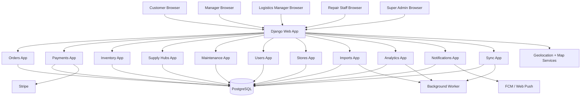

---

## Section 3 - User Management & Security

### 3.1 Architectural Overview

The security model must support **broad product variety with tight scope boundaries**.

Roles are intentionally not symmetrical:

- `general_user` is temporary and mostly anonymous,
- `account_user` is persistent and cross-store,
- `manager` is operational and store-scoped,
- `admin` is store-scoped but focused on people/accounts,
- `logistics_manager` is region-scoped,
- `repair_staff` is assigned to specific stores,
- `super_admin` is system-wide.

The easiest way to keep this sane is to treat **role** and **scope** as separate concepts.

### 3.2 User Model Design

Recommended implementation:

1. **Custom `User` model** extending `AbstractUser`
2. **Store/region assignment tables** rather than shoving every scope into one row
3. **Guest orders** stored separately from persistent account users

#### Proposed Models

##### `User`

| Field | Type | Notes |
|---|---|---|
| `id` | UUID | primary key |
| `email` | EmailField | unique login identifier |
| `username` | CharField | optional display/use in admin |
| `first_name` / `last_name` | CharField | standard |
| `role` | CharField(enum) | `account_user`, `manager`, `admin`, `logistics_manager`, `repair_staff`, `super_admin` |
| `status` | CharField(enum) | `active`, `locked`, `disabled`, `pending` |
| `phone_number` | CharField | optional for notifications |
| `preferred_store_id` | FK(Store, nullable) | account-user convenience |
| `default_region_id` | FK(Region, nullable) | optional for logistics defaults |
| `is_email_verified` | BooleanField | optional but useful |
| `created_at` | DateTimeField | audit |
| `updated_at` | DateTimeField | audit |

##### `UserStoreAssignment`

Use this to connect people to stores without making the `User` model weird.

| Field | Type | Notes |
|---|---|---|
| `id` | UUID | PK |
| `user_id` | FK(User) | assigned user |
| `store_id` | FK(Store) | store scope |
| `assignment_type` | CharField | `primary`, `secondary`, `repair_scope`, `admin_scope`, `manager_scope` |
| `created_at` | DateTimeField | audit |

##### `UserRegionAssignment`

| Field | Type | Notes |
|---|---|---|
| `id` | UUID | PK |
| `user_id` | FK(User) | assigned user |
| `region_id` | FK(Region) | region scope |
| `assignment_type` | CharField | `logistics_scope`, `oversight_scope` |
| `created_at` | DateTimeField | audit |

##### `GuestOrderContact`

| Field | Type | Notes |
|---|---|---|
| `id` | UUID | PK |
| `order_id` | OneToOne(Order) | one guest contact per guest order |
| `display_name` | CharField | optional |
| `email` | EmailField | optional |
| `phone_number` | CharField | optional |
| `lookup_code` | CharField | short retrieval code |
| `expires_at` | DateTimeField | cleanup deadline |

#### Design Decisions and Justification

| Decision | Why |
|---|---|
| Separate user role from scope | avoids messy “one role, many stores” hacks |
| Do not persist guest users as normal `User` rows | keeps long-term preference storage aligned with requirements |
| Use UUIDs | easier merging, safer references, less guessable IDs |
| Keep preferred store on account user | supports store recommendation fallback |
| Store assignments in tables | lets repair staff cover many stores without custom columns everywhere |

### 3.3 Role-Based Access Control (RBAC)

| Role | Store Access | Region Access | Core Powers |
|---|---|---|---|
| `general_user` | one-time order only | none | guest checkout, order lookup |
| `account_user` | any store for personal ordering | none | history, favorites, preferences |
| `manager` | own store only | none | inventory, payments, revenue, order ops |
| `admin` | own store only | none | user account management for own store |
| `logistics_manager` | operational visibility across managed stores | assigned region(s) | hub inventory, transfers, supply schedules, CSV usage imports |
| `repair_staff` | assigned stores only | implied by assigned stores | machine status, assignments, schedules |
| `super_admin` | all stores | all regions | system-wide visibility and privileged administration |

#### Enforcement Strategy

RBAC must be enforced in **four places**, not just one:

1. View decorators / mixins
2. Queryset scoping
3. Service-layer guard clauses
4. Template-level visibility checks

> **Important:** hiding a button is not security. The server must reject out-of-scope operations even if a crafted request is submitted manually.

#### Recommended Permission Helpers

```python
def user_can_manage_store(user, store) -> bool: ...
def user_can_view_region(user, region) -> bool: ...
def user_can_manage_machine(user, machine) -> bool: ...
def user_can_approve_transfer(user, transfer) -> bool: ...
```

### 3.4 Authentication Strategy

The main authentication model is **Django session authentication**.

Why:

- primary client is browser-based,
- Django already handles sessions, auth middleware, CSRF protection,
- it fits server-rendered pages naturally,
- it reduces unnecessary token complexity for the team.

#### Login Flow

1. user submits email/password,
2. credentials checked against custom `User`,
3. session created,
4. role-aware redirect issued,
5. store/region scoping loaded on demand.

#### Token Lifecycle

Not the primary flow.  
Reserve API tokens or JWT for:

- future external APIs,
- automation endpoints,
- possibly native/mobile clients later.

#### Brute Force Protection

Implement:

- lockout or throttling after repeated failed logins,
- timestamped failed-attempt counters,
- optional reCAPTCHA for public account/guest actions if needed later.

### 3.5 Password and Credential Security

| Rule | Implementation |
|---|---|
| Password storage | Django PBKDF2/Argon2 hashes |
| Secrets | environment variables only |
| Reset links | signed + time-limited |
| Session cookies | secure, httpOnly, sameSite |
| CSRF | enabled for session-authenticated POSTs |
| Staff actions | audit logged |

### 3.6 Stripe Payment Security

### Design Approach

The browser never computes trusted payment outcomes.  
The browser only initiates checkout and returns Stripe confirmation data.  
The server verifies:

- order exists,
- order belongs to correct store,
- price server-side matches authoritative calculation,
- payment intent maps to the correct order,
- refund rules are satisfied.

### Additional Protections

- never trust client-submitted totals,
- never store raw card data,
- verify webhook signatures,
- bind PaymentIntent metadata to `order_id` and `store_id`,
- log all refund attempts.

---

## Section 4 - Order & Payment System Design

## Section 4: Order & Payment System Design

### 4.1 Overview

This section describes how orders move from customer intent to store fulfillment.

The most important implementation rule is simple:

> **Every order belongs to exactly one store.**

That store is the authority for:

- pricing validation,
- fulfillment state,
- inventory impact,
- refund cutoff,
- pickup handling.

### Supported Order Types

| Order Type | Allowed? | Notes |
|---|---|---|
| Account-user immediate pickup | yes | normal flow |
| Account-user scheduled pickup | yes | near-term / same-day friendly |
| General-user immediate pickup | yes | guest checkout supported |
| Cross-store single order | no | one order = one store |
| Multi-store cart in one checkout | no | too complex for this project |

### 4.2 Order Lifecycle State Machine

Recommended low-level state machine:

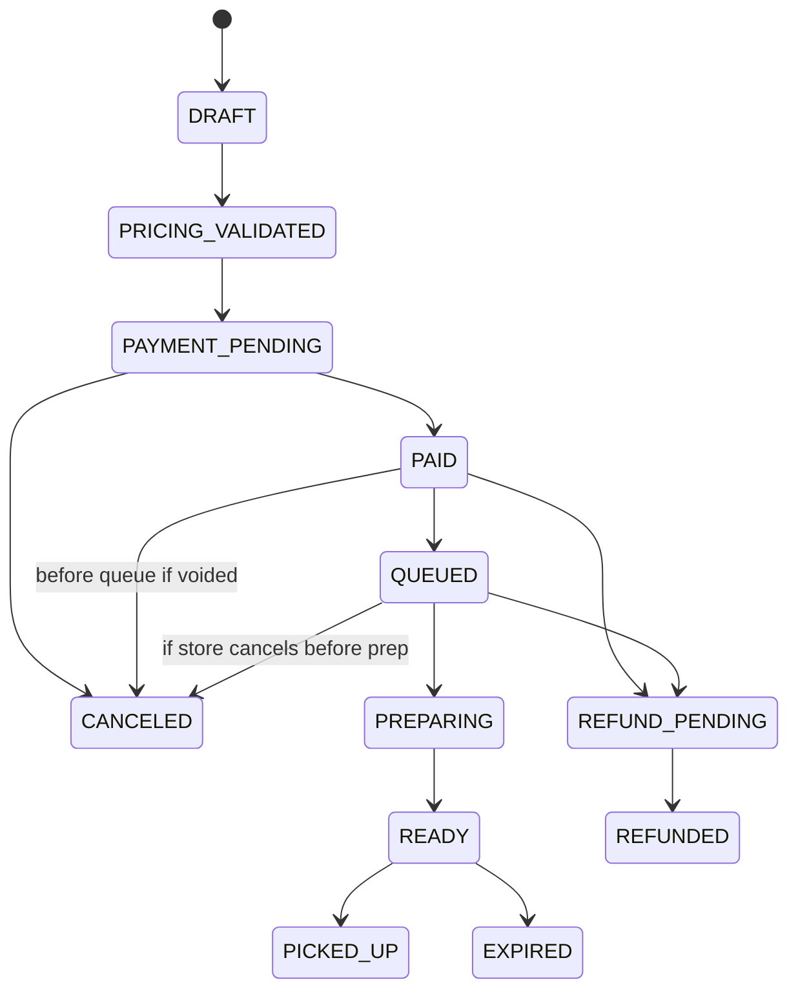

#### State Definitions

| State | Meaning |
|---|---|
| `draft` | cart exists, not finalized |
| `pricing_validated` | server has recalculated authoritative price |
| `payment_pending` | Stripe confirmation underway |
| `paid` | payment captured successfully |
| `queued` | store accepted order and has committed it for fulfillment |
| `preparing` | drink preparation started |
| `ready` | order is ready for pickup |
| `picked_up` | order completed |
| `refund_pending` | refund requested and under processing |
| `refunded` | funds returned |
| `canceled` | order canceled before or instead of fulfillment |
| `expired` | ready but not picked up within retention window |

#### Key Business Rules

| Rule | Implementation Note |
|---|---|
| payment captured at placement | use Stripe PaymentIntent confirmation |
| refund cutoff begins at `preparing` | after prep starts, refund disallowed unless privileged override |
| inventory reserved/deducted at `queued` | not at browser cart time and not delayed until pickup |
| guest orders still get full operational lifecycle | just without persistent preference history |

### 4.3 Data Models

#### 4.3.1 Order Model

| Field | Type | Notes |
|---|---|---|
| `id` | UUID | PK |
| `public_order_code` | CharField | customer-facing lookup code |
| `store_id` | FK(Store) | authoritative owner |
| `customer_id` | FK(User, nullable) | null for guest order |
| `order_type` | CharField | `account`, `guest` |
| `status` | CharField | order lifecycle state |
| `pickup_time_requested` | DateTimeField | user target |
| `pickup_time_estimated` | DateTimeField | system/store estimate |
| `subtotal_amount` | Decimal | server-calculated |
| `tax_amount` | Decimal | server-calculated |
| `total_amount` | Decimal | authoritative final total |
| `currency` | CharField | default USD |
| `placed_at` | DateTimeField | when payment confirmed |
| `queued_at` | DateTimeField | when store committed order |
| `preparing_at` | DateTimeField | when prep started |
| `ready_at` | DateTimeField | when ready |
| `picked_up_at` | DateTimeField | completion |
| `expires_at` | DateTimeField | pickup expiry |
| `cancel_reason` | TextField | nullable |
| `refund_status` | CharField | nullable |
| `created_at` | DateTimeField | audit |
| `updated_at` | DateTimeField | audit |

#### 4.3.2 Revenue Model

Revenue should be modeled as derived-but-durable financial records rather than loose aggregates in a dashboard query.

##### `PaymentTransaction`

| Field | Type | Notes |
|---|---|---|
| `id` | UUID | PK |
| `order_id` | OneToOne(Order) | one primary payment per order |
| `store_id` | FK(Store) | store revenue ownership |
| `stripe_payment_intent_id` | CharField | external reference |
| `status` | CharField | `pending`, `succeeded`, `failed`, `refunded`, `partially_refunded` |
| `amount_authorized` | Decimal | optional |
| `amount_captured` | Decimal | actual captured |
| `amount_refunded` | Decimal | refund sum |
| `captured_at` | DateTimeField | payment capture time |
| `last_webhook_at` | DateTimeField | reconciliation aid |

##### `RevenueLedgerEntry`

| Field | Type | Notes |
|---|---|---|
| `id` | UUID | PK |
| `store_id` | FK(Store) | reporting owner |
| `order_id` | FK(Order) | traceability |
| `entry_type` | CharField | `sale`, `refund`, `adjustment` |
| `gross_amount` | Decimal | full amount |
| `net_amount` | Decimal | after refund/adjustment |
| `posted_at` | DateTimeField | ledger timestamp |

#### 4.3.3 Drink Model (Order-Relevant Fields)

To avoid historical drift, use a **snapshot pattern** for ordered drinks.

##### `DrinkTemplate` (optional / reusable)

| Field | Type | Notes |
|---|---|---|
| `id` | UUID | PK |
| `name` | CharField | display name |
| `base_type` | CharField | soda / smoothie / etc. |
| `size` | CharField | default size |
| `is_seasonal` | Boolean | optional |
| `is_active` | Boolean | active in menu |
| `created_by_store_id` | FK(Store, nullable) | optional store ownership |

##### `OrderItem`

| Field | Type | Notes |
|---|---|---|
| `id` | UUID | PK |
| `order_id` | FK(Order) | parent order |
| `template_id` | FK(DrinkTemplate, nullable) | source template if any |
| `display_name_snapshot` | CharField | immutable order-facing name |
| `size_snapshot` | CharField | immutable |
| `base_price_snapshot` | Decimal | immutable |
| `customizations_json` | JSONField | flavors, add-ins, no-ice, etc. |
| `quantity` | Integer | positive |
| `line_total` | Decimal | authoritative line total |

##### `UserFavoriteDrink`

| Field | Type | Notes |
|---|---|---|
| `id` | UUID | PK |
| `user_id` | FK(User) | account-user only |
| `name` | CharField | user label |
| `template_id` | FK(DrinkTemplate, nullable) | optional |
| `customization_json` | JSONField | saved configuration |
| `last_ordered_at` | DateTimeField | recommendation aid |

### 4.4 Endpoints and Internal APIs

#### 4.4.1 Order CRUD Endpoints

| Method | Path | Purpose | Auth |
|---|---|---|---|
| `GET` | `/orders/cart/` | show current cart | session or guest session |
| `POST` | `/orders/cart/items/` | add item | session or guest session |
| `PATCH` | `/orders/cart/items/<id>/` | update item | session or guest session |
| `DELETE` | `/orders/cart/items/<id>/` | remove item | session or guest session |
| `POST` | `/orders/checkout/validate/` | server-side pricing validation | session or guest session |
| `POST` | `/orders/checkout/confirm/` | create order + payment intent | session or guest session |
| `GET` | `/orders/<code>/` | order status page | owner, guest lookup, or store staff |
| `POST` | `/orders/<id>/mark-preparing/` | transition to preparing | manager/store ops |
| `POST` | `/orders/<id>/mark-ready/` | transition to ready | manager/store ops |
| `POST` | `/orders/<id>/mark-picked-up/` | complete pickup | manager/store ops |
| `POST` | `/orders/<id>/cancel/` | cancel if allowed | owner or store |
| `POST` | `/orders/<id>/refund/` | initiate refund if allowed | owner/store/admin depending on state |

#### 4.4.2 Order Creation Request Body

```json
{
  "store_id": "uuid-store",
  "pickup_time_requested": "2026-03-19T16:30:00Z",
  "items": [
    {
      "template_id": "uuid-template",
      "size": "medium",
      "quantity": 1,
      "customizations": {
        "flavors": ["vanilla", "coconut"],
        "extras": ["cream"]
      }
    }
  ],
  "guest_contact": {
    "email": "guest@example.com",
    "phone_number": "5551234567"
  }
}
```

#### 4.4.3 Payment Endpoint

Server returns Stripe client secret after authoritative recalculation.

```json
{
  "order_id": "uuid-order",
  "public_order_code": "CP-REGC-10231",
  "client_secret": "pi_xxx_secret_xxx",
  "total_amount": "6.85",
  "currency": "usd"
}
```

#### 4.4.4 Revenue Endpoints

| Method | Path | Purpose |
|---|---|---|
| `GET` | `/payments/revenue/summary/` | store or region summary by role |
| `GET` | `/payments/revenue/daily/` | time-series revenue |
| `GET` | `/payments/revenue/orders/` | order-backed financial list |

#### 4.4.5 Email Confirmation Endpoint

Optional if the team supports email-based confirmations.

| Method | Path | Purpose |
|---|---|---|
| `POST` | `/orders/<id>/send-confirmation/` | resend confirmation |

### 4.5 Frontend Order Flow

#### 4.5.1 Cart Management

Use session-backed cart handling for both guests and account users.

| Concern | Recommendation |
|---|---|
| cart persistence | session for guests, DB/session hybrid for account users |
| pricing | always recompute server-side |
| edit/remove item | HTMX partial updates |
| store switch | clear or explicitly migrate cart after warning |

#### 4.5.2 Checkout Flow

1. customer selects store,
2. customer builds cart,
3. server validates authoritative pricing,
4. payment intent created,
5. payment confirmed,
6. order persisted,
7. store receives new order notification,
8. order moves to `queued` when accepted.

#### 4.5.3 Post-Checkout & Preparation Timing

When the store accepts the order into the active prep queue:

- order becomes `queued`,
- inventory is reserved/deducted,
- fulfillment timer begins,
- refund eligibility remains open only until prep starts.

### 4.6 Refund Processing

| Case | Allowed? | Notes |
|---|---|---|
| customer cancels before `queued` | yes | straightforward full refund |
| customer cancels at `queued` before prep | yes | full refund allowed |
| customer cancels after `preparing` | no by default | only privileged/manual exception |
| store cancels due to issue | yes | full refund and reason logged |
| partial refund | optional | only if team implements it intentionally |

#### Refund Workflow

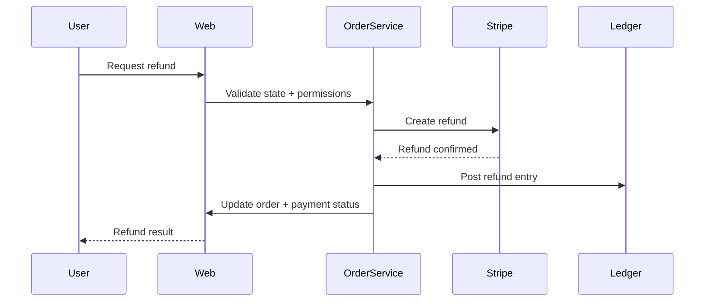

### 4.7 Order Expiration

Orders that remain `ready` past their pickup window move to `expired`.

Recommended behavior:

- do not auto-refund expired ready orders by default,
- allow store policy review later,
- log expiration for analytics.

### 4.8 Sequence Diagram — Complete Order Flow

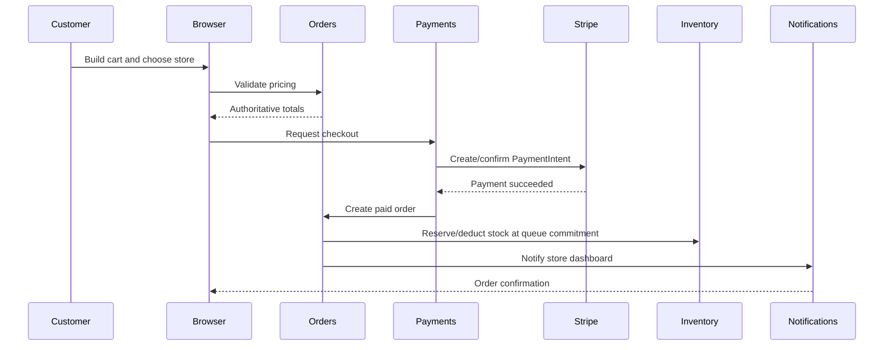

---

## Section 5 — Supply Hub & Inventory Management

### 5.1 Overview

The supply module now supports more than “store inventory.” It coordinates stock across:

- stores,
- local suppliers,
- regional supply hubs,
- approved transfer workflows.

This is one of the biggest requirement expansions, so the LLD must be precise.

### 5.2 Module Components

| Component | Purpose |
|---|---|
| item catalog | defines trackable supply types |
| store inventory balances | on-hand and reserved counts per store |
| hub inventory balances | on-hand and reserved counts per hub |
| replenishment records | records receipts from suppliers or hubs |
| supply transfers | approved stock movement workflow |
| supply schedules | predicted / human-approved recurring replenishment plans |
| usage records | imported or calculated consumption trends |
| alerts | low-stock and supply risk notifications |

### 5.3 Data Models

> **Design philosophy:** one item catalog, many balance tables, explicit movement records.

#### Region (`stores_region`)

| Field | Type | Notes |
|---|---|---|
| `id` | UUID | PK |
| `code` | CharField | `A`..`G` |
| `name` | CharField | display name |
| `hub_city` | CharField | e.g., Logan, UT |
| `center_latitude` | Decimal | optional |
| `center_longitude` | Decimal | optional |

#### Store (`stores_store`)

| Field | Type | Notes |
|---|---|---|
| `id` | UUID | PK |
| `region_id` | FK(Region) | exactly one region |
| `name` | CharField | display name |
| `address_line_1` | CharField | required |
| `city` | CharField | required |
| `state_code` | CharField | 2-char |
| `postal_code` | CharField | required |
| `latitude` | Decimal | geolocation |
| `longitude` | Decimal | geolocation |
| `is_active` | Boolean | active |
| `timezone` | CharField | used for pickup windows |
| `store_code` | CharField | human-readable key |

#### InventoryItem (`inventory_inventoryitem`)

This is the catalog definition, not the quantity at a location.

| Field | Type | Notes |
|---|---|---|
| `id` | UUID | PK |
| `sku` | CharField | unique |
| `name` | CharField | display name |
| `category` | CharField | syrup, soda, dairy, cups, lids, ice_cream, cleaning, etc. |
| `unit_of_measure` | CharField | bottle, case, bag, tub, unit |
| `is_perishable` | Boolean | storage logic |
| `requires_frozen_storage` | Boolean | for ice cream / frozen items |
| `default_low_stock_threshold` | Decimal | fallback threshold |
| `is_active` | Boolean | menu/supply availability |

#### StoreInventoryBalance (`inventory_storeinventorybalance`)

| Field | Type | Notes |
|---|---|---|
| `id` | UUID | PK |
| `store_id` | FK(Store) | location owner |
| `inventory_item_id` | FK(InventoryItem) | item |
| `on_hand_quantity` | Decimal | physical quantity |
| `reserved_quantity` | Decimal | promised but not moved/used yet |
| `reorder_threshold` | Decimal | store-specific threshold |
| `updated_at` | DateTimeField | audit |

#### SupplyHub (`supply_hubs_supplyhub`)

| Field | Type | Notes |
|---|---|---|
| `id` | UUID | PK |
| `region_id` | FK(Region) | one primary region |
| `name` | CharField | hub display name |
| `city` | CharField | required |
| `state_code` | CharField | required |
| `latitude` | Decimal | required |
| `longitude` | Decimal | required |
| `is_active` | Boolean | active |
| `hub_code` | CharField | business code |

#### HubInventoryBalance (`supply_hubs_hubinventorybalance`)

| Field | Type | Notes |
|---|---|---|
| `id` | UUID | PK |
| `hub_id` | FK(SupplyHub) | source hub |
| `inventory_item_id` | FK(InventoryItem) | item |
| `on_hand_quantity` | Decimal | physical stock |
| `reserved_quantity` | Decimal | allocated stock |
| `updated_at` | DateTimeField | audit |

#### LocalSupplier (`inventory_localsupplier`)

| Field | Type | Notes |
|---|---|---|
| `id` | UUID | PK |
| `name` | CharField | supplier name |
| `service_region_id` | FK(Region, nullable) | optional dominant region |
| `contact_name` | CharField | optional |
| `email` | EmailField | optional |
| `phone_number` | CharField | optional |
| `item_categories_json` | JSONField | supported categories |
| `is_active` | Boolean | active |

#### SupplierReplenishment (`inventory_supplierreplenishment`)

| Field | Type | Notes |
|---|---|---|
| `id` | UUID | PK |
| `supplier_id` | FK(LocalSupplier) | vendor |
| `store_id` | FK(Store) | receiving store |
| `inventory_item_id` | FK(InventoryItem) | item |
| `quantity_received` | Decimal | receipt quantity |
| `received_at` | DateTimeField | receipt time |
| `recorded_by_id` | FK(User) | audit |
| `unit_cost` | Decimal | optional |

#### SupplyTransfer (`supply_hubs_supplytransfer`)

Represents movements between eligible sources and destinations.

| Field | Type | Notes |
|---|---|---|
| `id` | UUID | PK |
| `source_type` | CharField | `store`, `hub`, `supplier` (supplier usually becomes replenishment, not transfer) |
| `source_store_id` | FK(Store, nullable) | source store |
| `source_hub_id` | FK(SupplyHub, nullable) | source hub |
| `destination_store_id` | FK(Store) | receiving store |
| `requested_by_id` | FK(User) | initiator |
| `approved_by_id` | FK(User, nullable) | approver |
| `status` | CharField | `requested`, `approved`, `reserved`, `in_transit`, `delivered`, `received`, `rejected`, `canceled` |
| `transfer_scope` | CharField | `same_region_store`, `hub_to_store`, `cross_region_hub` |
| `distance_miles` | Decimal | calculated |
| `requested_at` | DateTimeField | audit |
| `approved_at` | DateTimeField | audit |
| `delivered_at` | DateTimeField | audit |
| `received_at` | DateTimeField | audit |
| `notes` | TextField | optional |

#### SupplyTransferLineItem (`supply_hubs_supplytransferlineitem`)

| Field | Type | Notes |
|---|---|---|
| `id` | UUID | PK |
| `transfer_id` | FK(SupplyTransfer) | parent |
| `inventory_item_id` | FK(InventoryItem) | item |
| `quantity_requested` | Decimal | requested |
| `quantity_approved` | Decimal | approved |
| `quantity_received` | Decimal | received |

#### RestockAlert (`inventory_restockalert`)

| Field | Type | Notes |
|---|---|---|
| `id` | UUID | PK |
| `store_id` | FK(Store) | affected store |
| `inventory_item_id` | FK(InventoryItem) | item |
| `severity` | CharField | `info`, `warning`, `critical` |
| `status` | CharField | `open`, `acknowledged`, `resolved` |
| `triggered_by` | CharField | threshold, prediction, manual |
| `created_at` | DateTimeField | audit |
| `resolved_at` | DateTimeField | nullable |

#### SupplyUsageRecord (`inventory_supplyusagerecord`)

| Field | Type | Notes |
|---|---|---|
| `id` | UUID | PK |
| `store_id` | FK(Store) | store |
| `inventory_item_id` | FK(InventoryItem) | item |
| `usage_date` | DateField | usage date |
| `quantity_used` | Decimal | usage |
| `source_import_job_id` | FK(ImportJob, nullable) | traceability |

#### SupplySchedule (`inventory_supplyschedule`)

| Field | Type | Notes |
|---|---|---|
| `id` | UUID | PK |
| `store_id` | FK(Store) | store |
| `inventory_item_id` | FK(InventoryItem) | item |
| `recommended_source_type` | CharField | hub / local_supplier / local_store |
| `recommended_source_id` | UUID or JSON | resolved by source type |
| `recommended_quantity` | Decimal | amount |
| `recommended_frequency_days` | Integer | cadence |
| `created_by_ai` | Boolean | ai-generated draft |
| `approved_by_id` | FK(User, nullable) | logistics manager approval |
| `status` | CharField | `draft`, `approved`, `inactive` |

### 5.4 Key Business Logic

#### Inventory Deduction at Queue Commitment

Inventory is not deducted in the browser, and it is not delayed until pickup.

**Authoritative rule:** inventory is reserved/deducted when the store commits a paid order into the live fulfillment queue (`queued`).

Reasons:

- prevents overselling after payment,
- keeps operations aligned with actual prep commitment,
- makes cancellation and refund windows clearer.

#### Supply Hub Resolution (1000-Mile Rule)

When a store needs replenishment, eligible source preference is:

1. same-store on-hand stock (already local),
2. nearby same-region store transfer,
3. local supplier,
4. home-region hub,
5. cross-region hub within 1000 miles.

Distance rule applies **hub-to-destination-store**.

#### Store-to-Store Transfers

Direct store-to-store transfers are only allowed **within the same region**.

This avoids turning every store into a free-for-all cross-country source and keeps logistics manageable.

#### Transfer State Machine

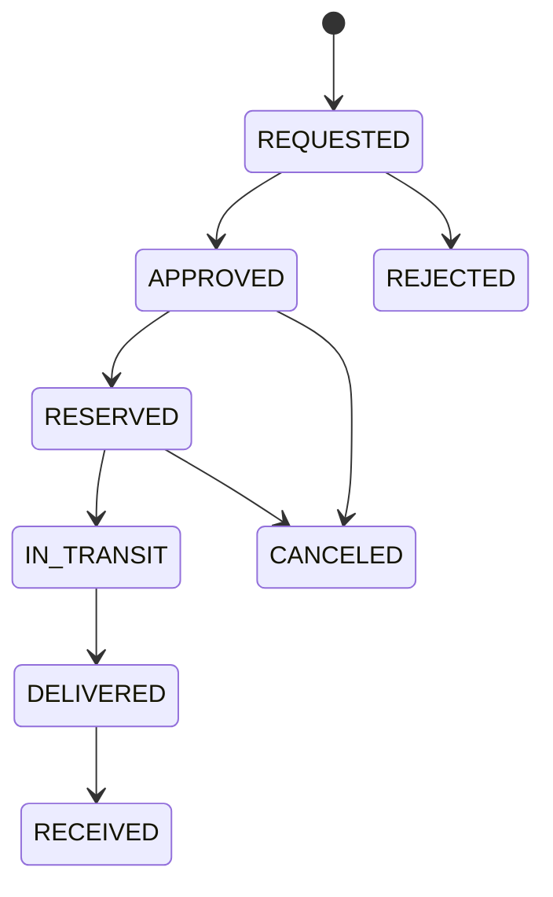

#### AI Restock Recommendations

AI and analytics may recommend schedules, but they do not automatically mutate store balances.

**Human approval required:** `logistics_manager` must approve supply schedules or transfer plans before they become operational.

#### Source of Truth Rules

| Data | Owner |
|---|---|
| store on-hand count | store |
| hub on-hand count | hub / logistics module |
| approved transfer reservation | source location |
| delivery confirmation | sending side may mark delivered |
| receipt confirmation | destination store finalizes received quantity |

### 5.5 Views and Endpoints

| Method | Path | Purpose | Auth |
|---|---|---|---|
| `GET` | `/inventory/store/` | store inventory view | manager/admin for store |
| `POST` | `/inventory/adjust/` | manual inventory correction | manager |
| `GET` | `/supply-hubs/dashboard/` | logistics dashboard | logistics_manager |
| `POST` | `/supply-hubs/transfers/` | create transfer request | manager/logistics_manager |
| `POST` | `/supply-hubs/transfers/<id>/approve/` | approve transfer | logistics_manager |
| `POST` | `/supply-hubs/transfers/<id>/ship/` | move to in_transit | source operator/logistics_manager |
| `POST` | `/supply-hubs/transfers/<id>/deliver/` | mark delivered | sender/hub |
| `POST` | `/supply-hubs/transfers/<id>/receive/` | confirm receipt | destination manager |
| `GET` | `/supply-hubs/recommendations/` | AI schedule drafts | logistics_manager |
| `POST` | `/supply-hubs/schedules/<id>/approve/` | approve schedule | logistics_manager |
| `POST` | `/imports/supply-usage/` | upload supply usage CSV | logistics_manager |

### 5.6 Logistics Manager Dashboard

The logistics dashboard should feel like an operations room, not a random set of tables.

#### Primary Panels

| Panel | Purpose |
|---|---|
| region health summary | overall risk and current stock picture |
| low-stock queue | prioritized shortages |
| transfer queue | requested / approved / in transit |
| hub stock table | source visibility by item |
| local supplier panel | local replenishment options |
| AI schedule drafts | suggested recurring replenishment |
| import history | CSV traceability and validation feedback |

#### Preferred Interaction Style

- table-first for operational speed,
- filters by region, store, item category, severity,
- inline HTMX actions for approvals and acknowledgements.

### 5.7 Granular Implementation Plan

#### Phase 1: Data Layer and Migrations

- add Region and Store models if not already present,
- add inventory catalog and balance tables,
- add LocalSupplier and SupplierReplenishment,
- add SupplyTransfer and line items,
- add SupplyUsageRecord and SupplySchedule,
- add indexes on `(store_id, inventory_item_id)` and `(hub_id, inventory_item_id)`.

#### Phase 2: Core Services

- `InventoryAdjustmentService`
- `InventoryReservationService`
- `TransferEligibilityService`
- `TransferWorkflowService`
- `RestockRecommendationService`
- `SupplyScheduleApprovalService`

#### Phase 3: Views, Templates, and Permissions

- manager store inventory page,
- logistics dashboard,
- transfer detail page,
- approval/receipt actions,
- low-stock alert page.

#### Phase 4: Dashboard Template and HTMX Panels

- region summary cards,
- shortage table,
- transfer queue,
- import history widget.

#### Phase 5: Testing, Monitoring, and Hardening

- transfer state transition tests,
- negative inventory prevention tests,
- threshold alert tests,
- 1000-mile eligibility tests,
- same-region transfer restrictions,
- approval permission tests.

### 5.8 Definition of Done

- stores and hubs have separate balances,
- local suppliers are modeled,
- same-region store transfers work,
- cross-region eligibility uses hub distance,
- low-stock alerts are visible,
- logistics manager dashboard works,
- supply usage CSV import produces traceable usage records,
- AI recommendations are drafts, not silent auto-changes.

### 5.9 Acceptance Test Checklist

- [ ] a manager can view only their store inventory
- [ ] a logistics manager can view all stores in their region
- [ ] a transfer cannot oversubscribe source stock
- [ ] a cross-region direct store transfer is rejected
- [ ] a hub within 1000 miles is eligible
- [ ] an invalid transfer state transition returns `409`
- [ ] a supply usage CSV creates records or fails transactionally
- [ ] approval and receipt events are audit logged

---

## Section 6 - Machine Maintenance & Repair Scheduling

## 6.1 Purpose

The maintenance subsystem tracks machine health and helps repair staff service assigned stores efficiently.

Its goals are:

- represent machines at each store,
- ingest status updates from CSV,
- detect warning and error conditions,
- generate repair assignments,
- optimize travel order,
- enforce maintenance policies,
- prevent machines from remaining in warning indefinitely.

> **Plain-English summary:** if a machine is acting sketchy, the system should not shrug and hope for the best.

## 6.2 Data Models

### MachineType

| Field | Type | Notes |
|---|---|---|
| `id` | UUID | PK |
| `code` | CharField | CSV-facing stable machine code |
| `name` | CharField | human-readable |
| `default_service_interval_days` | Integer | recommended max between service |
| `warning_max_operational_days` | Integer | max warning window before shutdown/escalation |
| `error_max_days` | Integer | optional stricter window |
| `is_active` | Boolean | active |

### Machine

| Field | Type | Notes |
|---|---|---|
| `id` | UUID | PK |
| `machine_uid` | CharField | unique machine identifier |
| `store_id` | FK(Store) | owning store |
| `machine_type_id` | FK(MachineType) | type |
| `operational_from_date` | DateField | from CSV or setup |
| `current_status` | CharField | cached latest status |
| `current_status_date` | DateField | cached latest status date |
| `last_service_date` | DateField | derived or direct |
| `next_service_due_date` | DateField | policy-driven |
| `is_active` | Boolean | active machine |

### MachineStatusEvent

| Field | Type | Notes |
|---|---|---|
| `id` | UUID | PK |
| `machine_id` | FK(Machine) | target machine |
| `status` | CharField | `normal`, `repair-start`, `repair-end`, `warning`, `error`, `out-of-order`, `schedule-service` |
| `status_date` | DateField | when status recorded |
| `source_import_job_id` | FK(ImportJob, nullable) | traceability |
| `notes` | TextField | optional |
| `created_at` | DateTimeField | audit |

### RepairAssignment (Service Visit)

| Field | Type | Notes |
|---|---|---|
| `id` | UUID | PK |
| `assigned_to_id` | FK(User) | repair_staff |
| `machine_id` | FK(Machine) | machine |
| `store_id` | FK(Store) | denormalized for fast lookup |
| `priority_score` | Decimal | route/urgency ranking |
| `status` | CharField | `scheduled`, `in_progress`, `completed`, `canceled` |
| `scheduled_for` | DateTimeField | visit time |
| `completed_at` | DateTimeField | completion |
| `created_by_system` | Boolean | auto-generated or manual |
| `route_batch_key` | CharField | groups visits |
| `notes` | TextField | optional |

### MaintenancePolicy

| Field | Type | Notes |
|---|---|---|
| `id` | UUID | PK |
| `machine_type_id` | FK(MachineType) | type-specific policy |
| `region_id` | FK(Region, nullable) | optional override |
| `max_days_between_service` | Integer | hard ceiling |
| `warning_shutdown_days` | Integer | warning tolerance |
| `schedule_service_window_days` | Integer | recommended maintenance lead time |
| `is_active` | Boolean | active rule |

## 6.3 Core Services and Responsibilities

### 6.3.1 Machine Registry Service

Responsibilities:

- create machine records during seeding/setup,
- optionally register missing machines during import if explicitly enabled,
- enforce unique machine UID,
- connect machine to store and type.

### 6.3.2 Status Tracking + Health Scoring

Responsibilities:

- append status events,
- update machine cached status,
- calculate urgency score,
- determine escalation needs,
- raise alerts for dashboards.

#### Health Scoring Concept

| Status | Base Severity |
|---|---|
| `normal` | 0 |
| `schedule-service` | 20 |
| `warning` | 50 |
| `error` | 80 |
| `out-of-order` | 100 |

Then add bonuses for:

- days overdue,
- store importance,
- repeated recent failures,
- route clustering opportunity.

### 6.3.3 Repair Scheduling Service (Constraint-Based)

The scheduler should create a prioritized work queue while honoring:

- assigned-store scope,
- max days between service,
- warning shutdown windows,
- machine severity,
- travel efficiency.

### 6.3.4 Route Optimization Service

This does not need to be “Uber-level route planning.”  
For the course project, a practical heuristic is enough:

1. filter assigned stores,
2. rank by urgency,
3. group by proximity,
4. sort within group by nearest-next distance.

If needed later, replace this with a better route optimizer without changing the rest of the module.

### 6.3.5 Alerts / Notifications for Repair Staff

Repair staff should receive:

- newly assigned urgent visits,
- machines entering warning or error,
- overdue service violations,
- route updates.

### 6.3.6 Escalation Rules

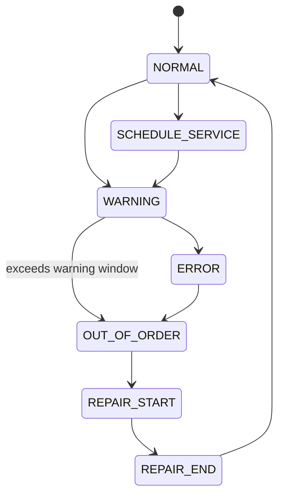

#### Important Rule

If a machine remains in `warning` longer than the allowed policy window, the system escalates it to a higher-severity state, preferably `out-of-order`, and prioritizes service immediately.

## 6.4 APIs (Internal Endpoints)

### Machine Status / Registry

| Method | Path | Purpose |
|---|---|---|
| `GET` | `/maintenance/machines/` | list machines in user scope |
| `GET` | `/maintenance/machines/<id>/` | machine detail |
| `POST` | `/maintenance/machines/<id>/status/` | append status event |
| `POST` | `/maintenance/machines/register/` | create machine (privileged) |

### Scheduling & Routing

| Method | Path | Purpose |
|---|---|---|
| `GET` | `/maintenance/assignments/` | repair work queue |
| `POST` | `/maintenance/assignments/generate/` | build or refresh schedule |
| `POST` | `/maintenance/assignments/<id>/start/` | mark in progress |
| `POST` | `/maintenance/assignments/<id>/complete/` | complete visit |
| `GET` | `/maintenance/routes/today/` | daily route list |

### Alerts

| Method | Path | Purpose |
|---|---|---|
| `GET` | `/maintenance/alerts/` | current repair alerts |
| `POST` | `/maintenance/alerts/<id>/ack/` | acknowledge alert |

## 6.5 Decentralized / Regional Sync Considerations

Maintenance is one of the few operational domains that benefits from regional visibility.

Recommended sync scope:

- share machine status summaries within region,
- share assignment visibility only to relevant repair staff and privileged roles,
- do not broadcast raw internal notes to everyone unnecessarily.

---

## Section 7 - Data Layer

### Section 7.1 - Database Schema

This section summarizes the full data design and relationships that Codex should respect.

### 7.1.1 Core Models

The actual number of models may vary by implementation, but the following set is the recommended design baseline.

| # | Model | Purpose |
|---|---|---|
| 1 | `User` | persistent authenticated users |
| 2 | `UserStoreAssignment` | store-level scope mapping |
| 3 | `UserRegionAssignment` | region-level scope mapping |
| 4 | `Region` | region metadata |
| 5 | `Store` | store metadata |
| 6 | `Order` | order lifecycle |
| 7 | `OrderItem` | immutable ordered drink snapshot |
| 8 | `GuestOrderContact` | guest lookup/contact support |
| 9 | `PaymentTransaction` | payment record |
| 10 | `RevenueLedgerEntry` | durable financial ledger |
| 11 | `InventoryItem` | supply catalog |
| 12 | `StoreInventoryBalance` | per-store stock |
| 13 | `SupplyHub` | hub metadata |
| 14 | `HubInventoryBalance` | per-hub stock |
| 15 | `LocalSupplier` | local supplier records |
| 16 | `SupplierReplenishment` | local supplier receipts |
| 17 | `SupplyTransfer` | movement workflow |
| 18 | `SupplyTransferLineItem` | movement lines |
| 19 | `RestockAlert` | shortage alert |
| 20 | `SupplyUsageRecord` | imported/recorded usage |
| 21 | `SupplySchedule` | AI/human-approved replenishment plan |
| 22 | `MachineType` | maintenance rules by machine type |
| 23 | `Machine` | machine registry |
| 24 | `MachineStatusEvent` | status history |
| 25 | `RepairAssignment` | repair work queue |
| 26 | `MaintenancePolicy` | policy overrides |
| 27 | `Notification` | in-app / push notices |
| 28 | `ImportJob` | import history and status |
| 29 | `SyncOutboxEvent` | durable sync event queue |
| 30 | `AuditLog` | privileged-action tracking |

#### Suggested Indexes

| Table | Index |
|---|---|
| `Order` | `(store_id, status)`, `(customer_id, placed_at)` |
| `StoreInventoryBalance` | unique `(store_id, inventory_item_id)` |
| `HubInventoryBalance` | unique `(hub_id, inventory_item_id)` |
| `SupplyTransfer` | `(status, requested_at)`, `(destination_store_id, status)` |
| `Machine` | `(store_id, current_status)` |
| `MachineStatusEvent` | `(machine_id, status_date desc)` |
| `RepairAssignment` | `(assigned_to_id, status, scheduled_for)` |
| `ImportJob` | `(import_type, status, created_at desc)` |
| `SyncOutboxEvent` | `(status, next_attempt_at)` |

#### 7.1.2 Relationships

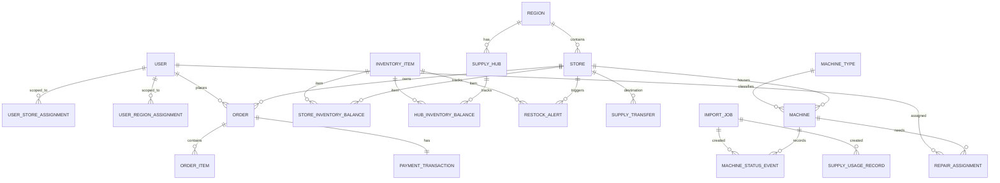

### ER Diagram (Class-Oriented View)

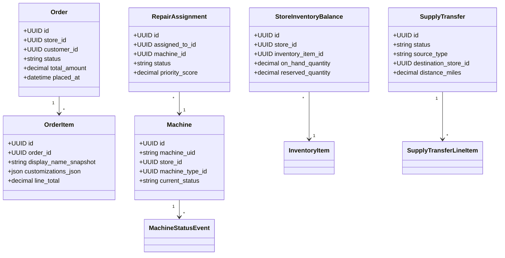

### Section 7.2 - Synchronization Architecture

#### 7.2.1 Architectural Model

The project simulates decentralized nodes inside one codebase, but synchronization rules are still documented because they shape data ownership and future architecture.

#### 7.2.2 Node Types

##### Store Node

Authoritative for:

- orders,
- local fulfillment state,
- store inventory balances,
- guest contact data,
- store-level staff operations.

##### Supply Hub Node

Authoritative for:

- hub inventory balances,
- regional transfer approvals (when scoped to logistics),
- cross-region hub eligibility decisions.

##### Regional Coordination (Logical Role)

No separate “regional server” is required in the course build.  
Instead, regional coordination is implemented through:

- region-scoped data access,
- outbox events,
- scheduled jobs,
- dashboards that aggregate region-approved data.

#### 7.2.3 Data Categories & Synchronization Scope

##### Local-Only Data

| Data | Why |
|---|---|
| active order internals | store-owned operational flow |
| raw payment transaction details | least-privilege financial handling |
| guest contact lookup codes | no need to share broadly |
| in-progress store staff notes | local operational detail |

##### Regional Synchronization Data

| Data | Why |
|---|---|
| inventory availability summaries | logistics coordination |
| transfer requests and statuses | movement workflow |
| hub stock summaries | region-wide replenishment planning |
| machine status summaries | repair planning |
| repair assignment summaries | route visibility |
| approved supply schedules | logistics execution |

##### Cross-Region (Limited Scope)

| Data | Why |
|---|---|
| eligible hub availability | 1000-mile replenishment rule |
| approved cross-region transfer summaries | logistics coordination |
| super-admin reporting aggregates | oversight |

#### 7.2.4 Synchronization Mechanism

Use an outbox-based model.

1. business action commits locally,
2. a `SyncOutboxEvent` row is inserted in the same transaction,
3. background worker processes event,
4. event is transformed into region/cross-region update,
5. receiving side (or simulated receiver) applies allowed fields,
6. audit trail stored.

##### Event-Triggered Synchronization

Candidates:

- transfer approval,
- transfer shipment,
- transfer receipt,
- machine status escalation,
- hub stock threshold changes,
- supply schedule approval.

#### 7.2.5 Message Structure

```json
{
  "event_id": "uuid",
  "event_type": "transfer.approved",
  "source_scope": {
    "store_id": "uuid-store",
    "region_code": "C"
  },
  "entity": {
    "type": "SupplyTransfer",
    "id": "uuid-transfer",
    "version": 4
  },
  "payload": {
    "status": "approved",
    "destination_store_id": "uuid-destination"
  },
  "created_at": "2026-03-19T18:00:00Z"
}
```

#### 7.2.6 Versioning Strategy

Use monotonically increasing `version` integers or `updated_at` plus optimistic guards for synchronized entities.

Recommended rule:

- local owner writes version,
- incoming update must be newer,
- conflicting non-owner writes are rejected or logged.

### Section 7.3 - Conflict Resolution

#### 7.3.1 Composite ID Model – Eliminates Most Conflicts

Conflicts are reduced by clear ownership:

- a store owns its orders,
- a hub owns its hub stock,
- a machine belongs to one store,
- only approved shared summaries sync outward.

That dramatically reduces true write-write conflict cases.

#### 7.3.2 Actual Conflict Scenarios (Rare)

##### Scenario 1: Cross-Store Supply Transfer

Two actors try to allocate the same source stock.

**Resolution:** reservation at approval time and database-level checks prevent oversubscription.

##### Scenario 2: Machine Status Regional Sync

Status summary arrives late.

**Resolution:** compare event date + owner version; latest valid owner event wins.

##### Scenario 3: Supply Hub Inventory Merge

Dashboard sees stale regional summary.

**Resolution:** hub remains source of truth; summary views are eventually consistent and refreshed.

#### 7.3.3 Resolution Rules (Simple)

| Case | Rule |
|---|---|
| store-owned order conflict | store wins |
| hub-owned stock conflict | hub wins |
| stale sync event | ignore and log |
| invalid state transition | reject with `409` |
| duplicate import row | reject or dedupe based on import policy |

#### 7.3.4 Machine Status Resolution (Only Cross-Store Sync)

Store-owned machine event history is authoritative.  
Regional dashboards receive summary projections, not permission to rewrite machine history.

#### 7.3.5 No Complex Split-Brain Resolution Needed

The project does not require full distributed database conflict algorithms.  
The ownership model is intentionally simpler.

#### 7.3.6 Sync Conflict Example (Full Walkthrough)

1. logistics manager approves transfer from Hub C to Store C-07,
2. hub stock reservation updates locally,
3. outbox event created,
4. destination store summary updated asynchronously,
5. if a stale “available stock” view still shows old stock temporarily, that is acceptable,
6. authoritative approval logic still uses reserved-aware stock at the source.

#### 7.3.7 When NOT to Sync

Do not sync:

- raw guest lookup data,
- incomplete cart state,
- local-only payment detail,
- internal notes not required for shared ops.

#### 7.3.8 Audit Logging

Every privileged action should log:

- actor,
- entity,
- action,
- prior status/value,
- new status/value,
- timestamp.

### Section 7.4 - Offline Handling

#### 7.4.1 Offline Mode Definition

Full disconnected store-node operation is beyond the course implementation, but the design should still document degraded behavior.

#### 7.4.2 Operations That Continue Offline

Conceptually:

- local dashboard read access from cached data,
- queueing of sync events,
- eventual replay of transfer/machine summary updates.

#### 7.4.3 Suspended Operations

- real payment confirmation,
- live cross-location transfer approvals,
- push delivery guarantees.

#### 7.4.4 Local Event Queue

The outbox table acts as the persistence layer for deferred outbound actions.

#### 7.4.5 Reconnection Workflow

1. worker retries pending outbox events,
2. stale summaries refresh,
3. alert counts re-evaluated,
4. audit log records recovery.

### Section 7.5 - Data Integrity Rules

#### 7.5.1 Inventory Rules

- quantity may not go negative,
- reserved quantity may not exceed on-hand quantity,
- receipt confirmation must reconcile with approved transfer quantity,
- only allowed actors may adjust balances directly.

#### 7.5.2 Machine Integrity Rules

- machine type must exist,
- store must exist,
- status enum must be valid,
- status date cannot be null,
- warning escalation cannot be silently ignored past policy window.

#### 7.5.3 Role-Based Access Integrity

- a manager cannot see another store’s payments,
- an admin cannot manage another store’s users,
- a logistics manager cannot freely edit store on-hand counts,
- repair staff only see assigned machines/stores,
- super-admin actions are audited.

#### 7.5.4 Transaction Integrity

Wrap these in database transactions:

- checkout confirm,
- refund posting,
- transfer approval and reservation,
- transfer receipt,
- CSV import processing,
- machine status escalation job.

#### 7.5.5 CSV Validation Rules

- required headers must match expected schema,
- invalid enum values fail import,
- invalid store references fail import,
- invalid date format fails import,
- all-or-nothing transaction by default,
- import result stored in `ImportJob`.

---

## Section 8 - Integrations

## 8.1 Stripe Integration

### 8.1.1 Overview

Stripe handles payment capture and refunds.  
The app remains the source of truth for order state and refund eligibility.

### 8.1.2 Architecture

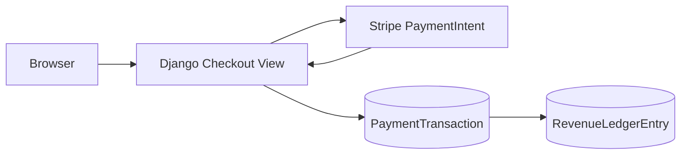

### 8.1.3 Configuration

```env
STRIPE_PUBLIC_KEY=...
STRIPE_SECRET_KEY=...
STRIPE_WEBHOOK_SECRET=...
```

### 8.1.4 Payment Flow — Detailed Implementation

#### Step 1: Create PaymentIntent (Backend)

- validate cart and store,
- calculate authoritative amount,
- create draft order or checkout token,
- create Stripe PaymentIntent with metadata,
- return client secret.

#### Step 2: Initialize Payment Element (Frontend)

- render Stripe element,
- collect payment details,
- keep total display synced to server response.

#### Step 3: Confirm Payment (Frontend)

- Stripe confirms,
- backend finalizes order and payment record,
- user gets order confirmation page.

#### Step 4: Process Refund (Backend)

- validate refund eligibility,
- issue Stripe refund,
- update payment record,
- post revenue ledger adjustment.

### 8.1.5 Security Considerations

- verify webhooks,
- do not trust client totals,
- bind payment to order/store metadata,
- audit refunds.

### 8.1.6 Supported Payment Methods

Minimum viable:

- standard card payment through Stripe.

### 8.1.7 Future Enhancements

- saved payment methods for account users,
- gift cards/store credit,
- partial refunds.

## 8.2 Push Notifications

### 8.2.1 Overview

Notifications support customer updates and operational alerts.

### 8.2.2 Notification Types

| Type | Audience |
|---|---|
| order confirmed | customer |
| order ready | customer |
| low stock critical | manager / logistics |
| transfer approved | logistics / relevant store |
| machine warning escalated | repair staff |
| repair assignment created | repair staff |

### 8.2.3 Data Model

##### `Notification`

| Field | Type | Notes |
|---|---|---|
| `id` | UUID | PK |
| `user_id` | FK(User, nullable) | recipient |
| `guest_contact_id` | FK(GuestOrderContact, nullable) | optional guest target |
| `notification_type` | CharField | kind |
| `title` | CharField | display title |
| `body` | TextField | message |
| `payload_json` | JSONField | metadata |
| `delivery_channel` | CharField | `in_app`, `push`, `email` |
| `status` | CharField | `pending`, `sent`, `failed`, `read` |
| `created_at` | DateTimeField | audit |
| `sent_at` | DateTimeField | nullable |

### 8.2.4 API Endpoints

| Method | Path | Purpose |
|---|---|---|
| `GET` | `/notifications/` | list notifications |
| `POST` | `/notifications/register-device/` | register token |
| `POST` | `/notifications/<id>/read/` | mark read |

### 8.2.5 FCM Integration Architecture

- store device token or browser push token,
- enqueue notification dispatch,
- record send status,
- degrade gracefully to in-app notification if push unavailable.

### 8.2.6 Notification Payload Structure

```json
{
  "type": "order_ready",
  "order_code": "CP-REGC-10231",
  "store_name": "CodePop Logan North",
  "action_url": "/orders/CP-REGC-10231/"
}
```

### 8.2.7 Notification Trigger Points

- order placed,
- order ready,
- transfer status changes,
- machine escalation,
- repair assignment created.

### 8.2.8 Future Enhancements

- SMS fallback,
- digest summaries,
- smart batching.

## 8.3 Geolocation Services

### 8.3.1 Overview

Geolocation helps account users and guests choose the best store.

### 8.3.2 Technology Stack

- browser geolocation API,
- map/distance provider for display,
- server-side distance helper for recommendation logic.

### 8.3.3 Client-Side Implementation

#### Location Permission Request

Ask only when recommendation is useful, not on every page load.

#### Distance Calculation — Haversine Formula

Use server-side or shared utility to calculate rough distances between coordinates.

#### Proximity Detection

Recommendation factors:

1. preferred store (if set),
2. requested pickup time feasibility,
3. current distance,
4. operational wait conditions,
5. availability.

### 8.3.4 Store Location Configuration

Each store must have:

- valid address,
- latitude/longitude,
- region,
- timezone.

### 8.3.5 Map Display

Maps are optional but helpful for:

- store locator,
- repair route view,
- logistics regional awareness.

### 8.3.6 Fallback Mechanisms

If location unavailable:

- use preferred store if account user has one,
- otherwise prompt manual selection.

### 8.3.7 Geolocation Data Flow

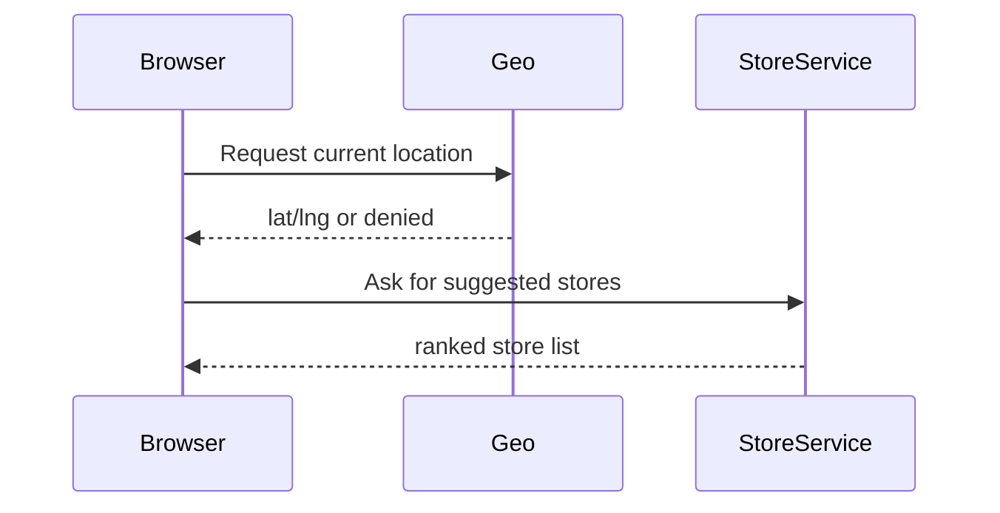

### 8.3.8 Privacy & Security

- do not store precise location longer than necessary,
- do not require location for checkout,
- avoid broad location history retention.

### 8.3.9 Pickup Timing Options Summary

- ASAP / next available,
- scheduled near-term pickup,
- preferred time slot within store capabilities.

### 8.3.10 Future Enhancements

- real traffic estimates,
- stronger wait-time prediction,
- route-aware store suggestion.

### 8.4 CSV Interface (Supply Usage)

#### 8.4.1 Purpose

Allows `logistics_manager` to upload supply-usage history so the system can detect patterns and draft replenishment schedules.

#### 8.4.2 Expected CSV Format

```csv
store_code,inventory_sku,usage_date,quantity_used
LOGN-01,SYR-VAN-001,2026-03-01,12
LOGN-01,CUP-MED-001,2026-03-01,64
```

#### 8.4.3 Upload Flow

1. logistics manager selects CSV,
2. system validates headers and row formats,
3. import job created,
4. file processed transactionally,
5. usage records created,
6. analytics task triggered,
7. AI draft schedules generated.

### 8.4.4 Validation Rules

- required headers exact match,
- store code must exist in user-managed region,
- sku must exist,
- quantity positive,
- date valid,
- duplicate policy documented.

### 8.4.5 Data Models

#### ImportJob (`imports_importjob`)

| Field | Type | Notes |
|---|---|---|
| `id` | UUID | PK |
| `import_type` | CharField | `supply_usage`, `repair_status` |
| `uploaded_by_id` | FK(User) | actor |
| `status` | CharField | `pending`, `processing`, `succeeded`, `failed` |
| `original_filename` | CharField | traceability |
| `row_count` | Integer | total rows |
| `success_count` | Integer | success rows |
| `error_count` | Integer | failed rows |
| `error_report_json` | JSONField | validation details |
| `created_at` | DateTimeField | audit |
| `completed_at` | DateTimeField | audit |

### 8.4.6 Views and Endpoints

| Method | Path | Purpose |
|---|---|---|
| `GET` | `/imports/supply-usage/` | upload page |
| `POST` | `/imports/supply-usage/` | submit file |
| `GET` | `/imports/<id>/` | import status |
| `GET` | `/imports/<id>/errors/` | row error report |

### 8.4.7 Post-Import AI Trigger

The import should enqueue an analytics job that:

- groups usage by store/item/time,
- identifies trends,
- drafts supply schedules,
- never auto-activates schedules without approval.

### 8.4.8 Granular Implementation Plan (CSV Interface)

- file upload form
- parser service
- validation layer
- transactional writer
- import history UI
- AI trigger

### 8.4.9 Definition of Done (Section 8.4)

- CSV uploads validate cleanly,
- invalid files do not partially mutate data,
- import history visible,
- AI drafts generated from valid usage records.

### 8.4.10 Acceptance Test Checklist (Section 8.4)

- [ ] invalid headers fail import
- [ ] out-of-scope store code fails import
- [ ] valid file writes usage records
- [ ] import history is auditable

### 8.5 CSV Interface (Repair / Machine Maintenance)

#### 8.5.1 Purpose

Allows `repair_staff` or authorized operators to import machine maintenance/status data in the required format.

#### 8.5.2 Expected CSV Format

```csv
store_address,machine_type_code,machine_operational_from_date,machine_status,status_date
123 Main St Logan UT,MIXER_A,2025-07-01,warning,2026-03-19
123 Main St Logan UT,MIXER_A,2025-07-01,repair-start,2026-03-22
```

#### 8.5.3 Supported Status Values

- `normal`
- `repair-start`
- `repair-end`
- `warning`
- `error`
- `out-of-order`
- `schedule-service`

#### 8.5.4 Import Rules

- store address must match a store or resolve through a deterministic mapping,
- machine type code must exist,
- operational-from date must be valid,
- status must be valid,
- status date must be valid,
- import runs transactionally by default.

#### 8.5.5 Processing Behavior

For each row:

1. resolve store,
2. resolve machine type,
3. find or create machine if import-based creation is enabled,
4. create `MachineStatusEvent`,
5. update machine cached status,
6. trigger policy evaluation,
7. potentially generate/refresh repair assignments.

#### 8.5.6 Endpoints

| Method | Path | Purpose |
|---|---|---|
| `GET` | `/imports/repair-status/` | upload page |
| `POST` | `/imports/repair-status/` | upload file |
| `GET` | `/imports/<id>/` | import detail |
| `GET` | `/maintenance/assignments/` | resulting work queue |

#### 8.5.7 Diagram

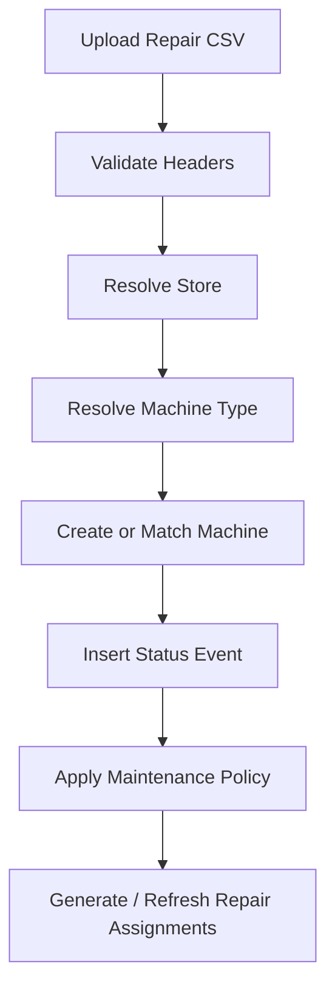

---

## Section 9 - Seed Data, Testing, and Implementation Guardrails

### 9.1 Required Seed Data

The seed plan must match the requirements exactly enough to be credible.

#### Supply Hubs

| Region | Hub City |
|---|---|
| A | Chicago, IL |
| B | New Jersey, NY |
| C | Logan, UT |
| D | Dallas, TX |
| E | Atlanta, GA |
| F | Phoenix, AZ |
| G | Boise, ID |

#### Stores

- Region C must have **20 stores**
- Nearby regions within **200 miles** should have **at least 5 stores per neighboring region**
- Seed realistic latitude/longitude and store codes

#### Roles & Assignments

- at least one `logistics_manager` for each hub region A–G
- Region C repair staff assignments
- store-level `manager` and `admin` users
- account users for customer flows
- guest checkout test fixtures

#### Machines

- multiple machine types
- multiple machines per store
- enough warning/error records to exercise repair scheduling

#### Inventory

- operationally meaningful stock across stores and hubs
- low-stock scenarios
- transfer-ready scenarios
- local supplier fixtures

### 9.2 Test Strategy Summary

| Layer | Examples |
|---|---|
| unit | state transition guards, pricing logic, distance calculations |
| integration | checkout + Stripe mocks, transfer approval, CSV imports |
| workflow | guest order flow, account recommendation flow, repair escalation flow |
| permission | role-based access restrictions |
| seed validation | hub/store counts and assignments |

### 9.3 Codex Guardrails

The following rules should be treated as implementation guardrails:

1. **Do not rename CodePop back to any older project name.**
2. **Do not model guest users as persistent account profiles.**
3. **Do not let managers or admins escape their store scope.**
4. **Do not let logistics managers directly overwrite store on-hand counts outside approved workflows.**
5. **Do not deduct inventory from browser-side assumptions.**
6. **Do not auto-refund after prep starts unless a clearly privileged override is intentionally added.**
7. **Do not allow direct cross-region store-to-store transfers.**
8. **Do not let AI mutate live schedules or balances without human approval.**
9. **Do not treat the Django admin as the user-facing dashboard.**
10. **Do not allow partial CSV mutations by default.**

### Quick “Do / Don’t” Table

| Do | Don’t |
|---|---|
| use services for workflows | hide critical logic in templates |
| preserve order item snapshots | mutate historical orders when templates change |
| keep ownership clear | let every role write everything |
| audit privileged actions | silently change sensitive data |
| keep dashboards actionable | build report-only dead ends |

---

## Section 10 - Conclusion

This LLD expands the original base web application into a detailed implementation design for a distributed, multi-store, region-aware CodePop platform.

The core ideas to preserve are:

- **one order, one store owner**
- **local by default**
- **regional sharing only where needed**
- **clear role boundaries**
- **explicit state machines**
- **AI as recommendation, not silent operator**
- **transactional imports**
- **seed data that matches the assignment**
- **humans and Codex both able to follow the plan**

If the team builds to this document, the system should be:

- easier to implement,
- easier to review,
- easier to test,
- and much harder to accidentally overcomplicate.