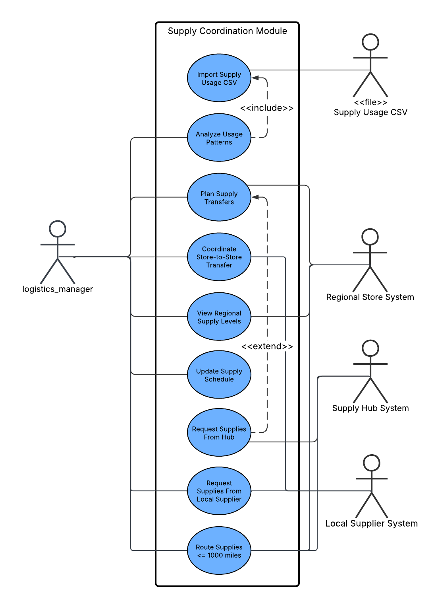
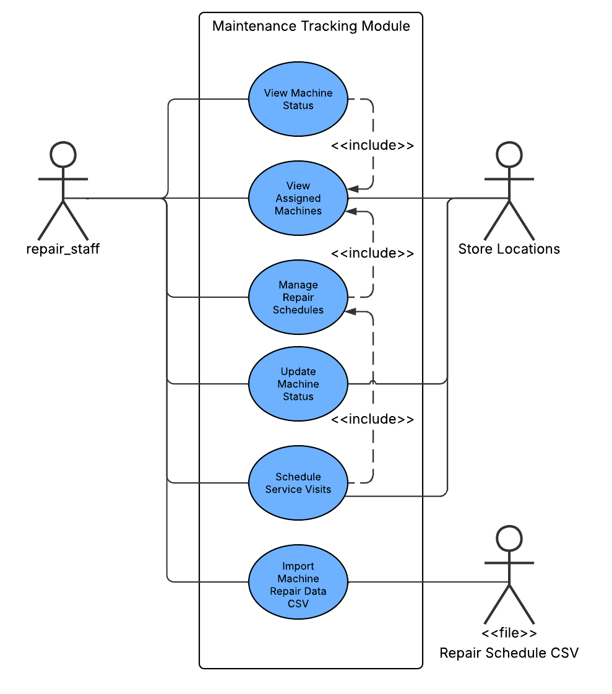
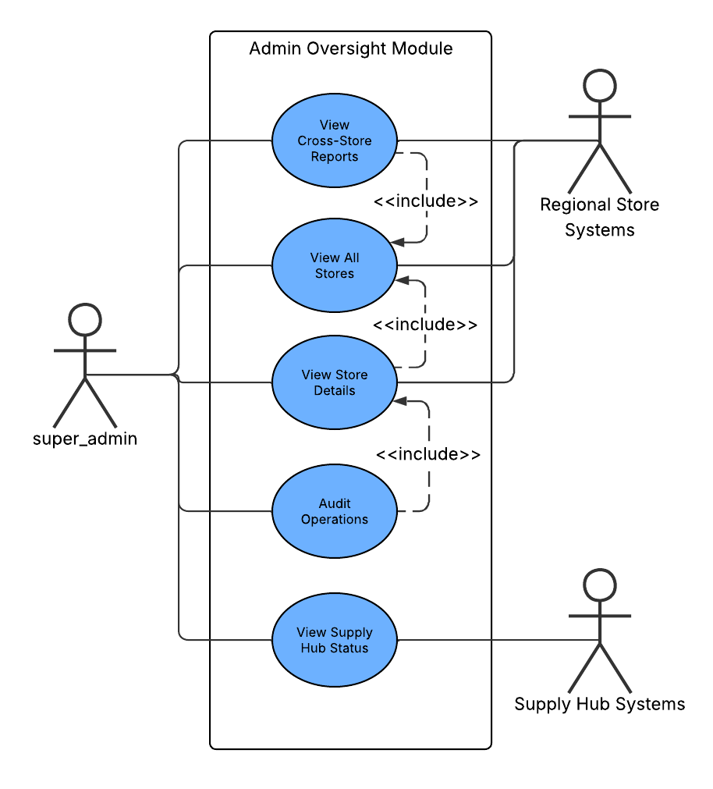
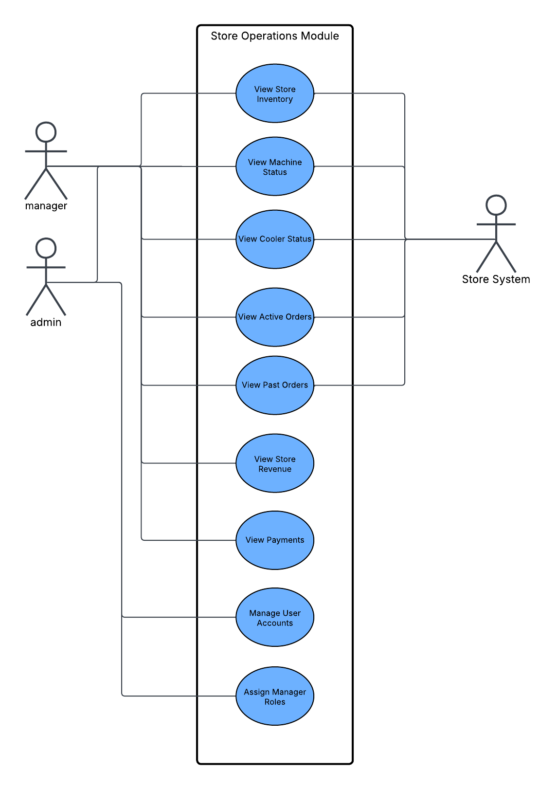

# CodePop 2026 Requirements

## Introduction

### Overview of CodePop

CodePop is an AI-driven custom soda ordering and fulfillment platform designed to automate the process of creating, ordering, and picking up custom sodas. The system combines mobile and web-based user interfaces with backend automation and AI-assisted decision-making to minimize human involvement while maintaining efficiency, consistency, and a high-quality user experience. CodePop allows users to customize drinks manually, receive AI-generated drink suggestions, or select from preset menus, while handling ordering, scheduling, and inventory management through automated systems.

The platform supports multiple user roles with different permissions and responsibilities, including general users, account users, managers, and administrators. Customers can place orders using either geolocation-based timing or manually selected pickup times to ensure drinks are prepared as close to arrival as possible. From an operational perspective, CodePop is designed to reduce staffing requirements by automating inventory tracking, order timing, and system monitoring, enabling a small number of managers to oversee store operations remotely.

This Spring 2026 project expands CodePop beyond its original scope. The system must now support multiple store locations nationwide, operate without a centralized server, and include advanced logistics and maintenance coordination. These changes introduce new architectural, organizational, and data-management challenges while preserving the core goals of automation, scalability, and usability that define CodePop.

---

### Purpose of Requirements Document

The purpose of this requirements document is to define and prioritize the functional and non-functional requirements for the extended CodePop system. This document serves as a shared reference for the development team and stakeholders by clearly describing what the system is expected to do, how responsibilities are divided among user roles, and which features are required, optional, or explicitly out of scope.

This document is intended to:

- Establish a clear understanding of new system requirements, including multi-store support, decentralized communication, supply hubs, and machine maintenance tracking.
- Define new user roles and permissions, such as logistics managers, repair staff, and super admins.
- Clarify updated responsibilities and access limits for existing roles.
- Provide a structured approach to requirement prioritization using MoSCoW analysis.
- Ensure continuity with the original CodePop requirements while allowing flexibility in system design and implementation.

This document does not mandate a specific implementation, architecture, programming language, or database technology. Teams are free to redesign or refactor the system as needed, provided all required constraints and deliverables outlined by the project are met.

---

### Introduction to MoSCoW Analysis

To manage scope and prioritize development effort, this project uses **MoSCoW analysis** as the requirements prioritization method. MoSCoW analysis categorizes requirements based on their importance to system functionality and project success.

The four MoSCoW categories are defined as follows:

- **Must Have (M):**  
  Requirements that are essential for the system to function and meet core project objectives. The system is considered incomplete if any Must Have requirements are not satisfied.

- **Should Have (S):**  
  High-priority requirements that significantly improve usability, performance, or maintainability but are not strictly required for minimal system operation.

- **Could Have (C):**  
  Desirable features that add value to the system but are not critical. These are typically implemented if time and resources allow.

- **Won’t Have (W):**  
  Features that are explicitly excluded from the current project scope and will not be implemented during this development cycle.

Each requirement in this document is labeled with its MoSCoW priority to ensure clarity and consistency across the development team.

---

## Summary of Previous Requirements

### Previous Requirements Overview

The original CodePop requirements defined a system focused on a single automated store with centralized management and minimal human involvement. The primary functional goals included allowing users to customize and order drinks through a mobile-first interface, supporting AI-generated drink recommendations, and automating operational tasks such as inventory tracking and order scheduling.

Key areas of functionality included:

- Mobile and web access for ordering drinks
- Manual and AI-assisted drink customization
- User accounts with saved preferences and favorites
- Geolocation-based and time-based order scheduling
- Role-based access for users, managers, and administrators
- Dashboards for monitoring inventory, orders, and revenue
- Non-functional requirements addressing security, accessibility, scalability, and maintainability

These requirements established the foundational user experience and automation goals that the CodePop system continues to build upon.

### Implementation status of previous outlined features

#### Implemented

- **Mobile Application Functionality** – Core application is fully functional on mobile devices with responsive design. 
- **User Authentication** – Secure login system allowing users to create accounts, sign in, and manage their profiles. 
- **AI-Powered Drink Generation** – Intelligent system that recommends or creates custom drinks based on user input or preferences. 
- **Inventory Tracking** – Database integration that monitors ingredient usage in real-time to maintain stock levels. 

#### In Progress / Incomplete

- **Ordering System** – Platform for users to place, modify, and track drink orders; backend logic and UI require further refinement. 
- **AI Customer Service** – Initial AI assistant implemented, but responses lack depth and contextual understanding; needs improvement for robust user interaction. 

#### Planned / Not Implemented

- **Payment Processing Integration** – Secure system to handle user payments, including credit card and digital wallet options. 
- **Geolocation Services** – Ability to detect user location to provide location-based services such as nearest store, delivery options, or pickup timing. 
- **Favorites Functionality** – Users can save and quickly reorder preferred drinks. 
- **Personalized Drink Preferences** – System to remember individual flavor profiles, dietary restrictions, and customizations. 
- **First-Time User Tutorial** – Onboarding flow guiding new users through app features and ordering process. 
- **Seasonal Menu Implementation** – Dynamic menu updates for seasonal or promotional drinks. 
- **Scheduled Drink Preparation** – Option for users to specify a desired ready-time instead of automatic preparation based on location. 
- **Order Expiration System** – Logic to discard drinks that have been in the cooler for too long, ensuring freshness and safety. 

## User Requirements

### What Users Need to Accomplish

#### Account Users
- Securely access personalized accounts to manage drink preferences, order history, and payment information
- Create and order customized drinks with confidence that their preferences are remembered
- Receive drinks fresh and ready upon arrival through geolocation-based preparation or scheduled pickup times
- Manage favorite drinks for quick reordering
- Control privacy settings for location data and payment information
- Rate drinks and receive personalized recommendations based on their feedback and preferences
- Cancel orders with immediate refunds when drinks haven't been prepared

#### General Users
- Place one-time orders without account creation barriers
- Access the full drink customization experience
- Receive drink suggestions based on popular choices
- Complete secure payment transactions
- Cancel orders and receive refunds before drink preparation

#### Managers
- Monitor real-time inventory levels across syrups, sodas, and add-ins
- Access revenue reports and payment data for their assigned store location
- Receive automated alerts when inventory reaches low thresholds
- View order processing metrics including preparation time and pickup statistics
- Track cooler status to ensure timely drink pickup and prevent waste
- Order supplies when notified by the AI inventory system

#### Admins
- Manage user accounts including unlocking, removing, or updating account status
- Create and configure manager accounts with appropriate permissions
- Access comprehensive user data for their specific store location
- Monitor store performance metrics and user activity
- Maintain security and integrity of the system at the store level

#### Super Admins
- Access data and manage operations across all store locations from a centralized dashboard
- Monitor system-wide performance, inventory trends, and revenue metrics
- Manage admin and manager accounts across all locations
- Implement company-wide policies and system configurations
- Generate cross-location analytics and comparative reports

#### Logistics Managers
- Monitor supply levels and usage patterns across multiple store locations within their region
- Optimize supply routing to minimize delivery costs and ensure timely restocking
- Leverage AI-driven insights from CSV data to identify supply usage trends
- Create and update supply schedules based on predictive analytics
- Coordinate with store managers to prevent stockouts and overstocking

#### Repair Staff
- Track maintenance schedules for all machines at assigned store locations
- Import and manage machine status data from CSV files containing location, machine type, operational dates, and current status
- Receive automated alerts for machines requiring immediate attention based on status (warning, error, out-of-order)
- Optimize repair routes using AI to minimize travel time while respecting maintenance constraints
- Prioritize repairs based on machine criticality and maximum allowable downtime
- Update machine status in real-time as maintenance is performed

---

### User Goals and Expectations

#### All Users
- Experience a responsive, intuitive interface across all devices (phones, tablets, desktops)
- Receive clear, helpful error messages when issues occur
- Trust that their data is encrypted and protected using industry-standard security protocols
- Access the application reliably with minimal downtime
- Navigate an accessible interface compliant with WCAG 2.1 standards

#### Account Users Specifically Expect
- Seamless onboarding with a brief tutorial introducing key features
- AI-powered drink recommendations that improve over time based on their preferences and ratings
- Flexible pickup options through geolocation tracking or scheduled preparation times
- A loyalty program that rewards repeat purchases
- The ability to share favorite drinks on social media platforms

#### Managers Expect
- A comprehensive dashboard displaying inventory grids sortable by remaining quantity
- Visual cooler status indicators showing full/empty states and order wait times
- Lists of processed orders with focus on in-progress and scheduled orders
- Real-time revenue statistics and performance metrics
- Automated notifications for low inventory with AI-suggested reorder quantities

#### Admins and Super Admins Expect
- Robust user management tools to maintain account security and system integrity
- Clear permission assignment capabilities for creating manager accounts
- Access to comprehensive reports on user activity, inventory costs, and revenue
- The ability to respond to user complaints and system issues efficiently

#### Logistics Managers Expect
- Centralized visibility into supply levels across all managed locations
- AI-driven forecasting to prevent supply shortages
- Route optimization tools that reduce fuel costs and delivery time
- Historical data analysis to identify seasonal trends and usage spikes
- Integration with CSV import for bulk data management

#### Repair Staff Expect
- A prioritized maintenance queue based on machine status and criticality
- GPS-optimized routing that minimizes travel between service locations
- CSV import functionality for bulk schedule uploads
- Automated alerts for machines approaching critical maintenance windows
- Mobile-friendly interface for on-site status updates

---

## User Roles and Personas

### Super Admin

**Role Overview:**
Super Admins have the highest level of system access and can manage operations across all store locations. They serve as the central authority for system-wide configuration, oversight, and strategic decision-making.

**Permissions and Responsibilities:**
- **Multi-Location Access:** View and manage data for any store location in the system
- **Global User Management:** Create, modify, and remove admin and manager accounts across all locations
- **System-Wide Analytics:** Access comprehensive reports including revenue trends, inventory patterns, and user engagement metrics across all stores
- **Policy Implementation:** Configure system-wide settings, business rules, and operational parameters
- **Security Oversight:** Monitor security logs, manage access controls, and respond to system-wide security incidents
- **Cross-Location Optimization:** Identify best practices from high-performing locations and implement them company-wide

**Typical Use Cases:**
- Analyzing revenue performance across multiple regions to identify growth opportunities
- Creating new admin accounts when opening a new store location
- Investigating system-wide issues reported by multiple store admins
- Generating quarterly reports for stakeholders on overall business performance

---

### Admin

**Role Overview:**
Admins manage a single store location with full access to user accounts, inventory, and operational data. They ensure the smooth day-to-day operation of their assigned location.

**Permissions and Responsibilities:**
- **Single-Location Access:** Full access to all data and functionality for their assigned store only
- **User Account Management:** Create, update, unlock, and remove user accounts associated with their location
- **Manager Creation:** Add manager accounts and assign appropriate permissions for their store
- **Store Operations:** Monitor inventory, revenue, payments, and user complaints specific to their location
- **Data Access:** View comprehensive analytics including stock levels, order metrics, and financial reports
- **Security Management:** Respond to account lockouts, suspicious activity, and user-reported security concerns

**Typical Use Cases:**
- Unlocking a customer account that was locked due to failed login attempts
- Creating a new manager account for a newly hired employee
- Reviewing revenue reports to assess weekly sales performance
- Investigating user complaints about drink quality or service issues

---

### Manager

**Role Overview:**
Managers focus on operational execution at a single store location. They monitor inventory, track orders, and ensure the location runs efficiently without requiring constant human presence.

**Permissions and Responsibilities:**
- **Single-Location Access:** Access to operational data for their assigned store only
- **Inventory Management:** Monitor stock levels for syrups, sodas, add-ins, and physical items; receive automated low-stock alerts
- **Order Monitoring:** View real-time order status including in-progress, scheduled, and completed orders
- **Payment Access:** Review user payment transactions and process refunds when necessary
- **Revenue Reporting:** Access financial reports showing daily, weekly, and monthly revenue
- **Cooler Management:** Monitor pickup cooler status to ensure old orders are discarded appropriately
- **Supply Ordering:** Respond to AI-generated reorder suggestions by placing supply orders

**Typical Use Cases:**
- Checking the dashboard in the morning to review overnight orders and current inventory
- Ordering more vanilla syrup after receiving an AI alert that it's running low
- Investigating why a cooler has had an order sitting for an unusually long time
- Generating a monthly revenue report to share with the store admin

---

### Logistics Manager

**Role Overview:**
Logistics Managers oversee supply chain operations for multiple stores within a geographic region. They ensure stores are stocked efficiently while minimizing costs and delivery time.

**Permissions and Responsibilities:**
- **Regional Store Access:** View inventory and supply data for all stores in their assigned region
- **Supply Management:** Monitor supplies including syrups, sodas, add-ins, cups, lids, and other physical items
- **Route Optimization:** Plan delivery routes to minimize fuel consumption and travel time
- **AI-Powered Analytics:** Import CSV files containing supply usage data; use AI to identify patterns and trends
- **Schedule Creation:** Develop and update supply delivery schedules based on predictive usage patterns
- **Inventory Forecasting:** Anticipate seasonal demand spikes and adjust supply orders proactively

**Typical Use Cases:**
- Importing a monthly CSV file showing syrup consumption across 15 stores in their region
- Using AI insights to identify that three stores consistently run low on cherry syrup on weekends
- Creating a new biweekly delivery schedule for high-traffic stores while maintaining weekly schedules for others
- Optimizing delivery routes to service all stores in a city within a single day

---

### Repair Staff

**Role Overview:**
Repair Staff maintain the machinery at store locations, ensuring drink-making robots and equipment operate reliably. They use data-driven scheduling to minimize downtime and travel costs.

**Permissions and Responsibilities:**
- **Multi-Location Machine Access:** View and manage repair schedules for machines at all assigned store locations
- **CSV Data Import:** Upload repair schedules containing store location, machine type, operational dates, and status information
- **Status Management:** Monitor machine statuses including:
  - **Normal:** Operating as expected
  - **Repair-Start:** Servicing has begun; machine offline
  - **Repair-End:** Servicing completed
  - **Warning:** Non-critical issue; operational but needs attention soon
  - **Error:** Critical issue; requires repair within one week
  - **Out-of-Order:** Not operational; immediate repair required
  - **Schedule-Service:** Operational but needs scheduled maintenance within one month
- **Route Optimization:** Use AI to plan service visits that minimize travel time while respecting constraints:
  - Maximum time between service visits for each machine type
  - Maximum operational time for machines with warnings before mandatory shutdown
- **Real-Time Updates:** Update machine status from the field as repairs are completed

**Typical Use Cases:**
- Importing a weekly CSV file containing updated machine statuses from automated monitoring systems
- Receiving an alert that a drink-making robot at Store #7 has an "error" status requiring repair within a week
- Planning a three-day service route covering 12 stores with machines requiring scheduled maintenance
- Updating a machine status from "repair-start" to "repair-end" after completing an on-site repair

---

### Account User

**Role Overview:**
Account Users are registered customers who have created accounts to access personalized features, save preferences, and enjoy a tailored ordering experience.

**Permissions and Responsibilities:**
- **Multi-Location Access:** Order drinks from any store location
- **Profile Management:** Update personal information, payment methods, and communication preferences
- **Preference Management:** Add liked and disliked ingredients to guide AI recommendations
- **Favorites:** Save frequently ordered drinks for quick reordering
- **Order History:** View past orders and reorder with a single tap
- **Location-Based Suggestions:** Receive recommendations on which store to visit based on current location and preferred pickup time
- **AI Recommendations:** Get personalized drink suggestions based on order history, preferences, and ratings
- **Rating System:** Rate drinks to improve future recommendations
- **Loyalty Participation:** Earn points through purchases and redeem rewards

**Typical Use Cases:**
- Opening the app to see which nearby location can have a drink ready fastest
- Reordering a favorite "Fall Girlie" drink from last week
- Rating a newly tried drink 4 stars and seeing updated AI recommendations based on the feedback
- Scheduling a drink to be ready at 3:00 PM when they arrive at work

---

### General User

**Role Overview:**
General Users access the application without creating an account. They can place one-time orders but do not have access to personalized features or saved data.

**Permissions and Responsibilities:**
- **One-Time Ordering:** Create and order custom drinks without account registration
- **Basic Customization:** Access the full drink builder with all available syrups, sodas, and add-ins
- **Popular Suggestions:** Receive drink recommendations based on popular choices rather than personal preferences
- **Payment:** Complete secure one-time payment transactions
- **Order Cancellation:** Cancel orders before preparation and receive immediate refunds
- **Location Selection:** Choose a pickup location and pickup time manually
- **No Data Persistence:** Preferences, favorites, and order history are not saved after the session ends

**Typical Use Cases:**
- Visiting a CodePop location while traveling and wanting to try a custom drink without creating an account
- Ordering a preset "Coke Float" as a first-time customer to test the service
- Selecting a pickup time of 30 minutes from now and completing payment
- Deciding not to place the order and receiving an immediate refund after cancellation

---

## Functional Requirements

### Multi-Store & Distributed Architecture

- (M) The system must support multiple store locations across the United States.
- (M) The system must not rely on a single centralized server. Each store must operate independently and communicate directly with other stores in its region.
- (M) Stores must be able to synchronize relevant data (inventory, supply needs, maintenance status) with nearby stores and regional supply hubs.
- (M) Synchronized data must include inventory levels, supply requests, machine status, and maintenance schedules.
- (M) The system must support seven predefined supply hub regions.

### User Roles & Permissions

- (M) The system must support the following roles:
  - super_admin
  - admin
  - manager
  - logistics_manager
  - repair_staff
  - account_user
  - general_user

- (M) Each role must have access only to the data and dashboards permitted by their role definition.

- (M) super_admin:
  - Has full read/write access to data for all store locations

- (M) admin:
  - Can access only their own store’s data.
  - Can manage user accounts (add, remove, unlock, grant permissions).
  - Can add and manage manager accounts.

- (M) manager:
  - Can access only their own store’s data.
  - Can view inventory, payments, and revenue reports.

- (M) logistics_manager:
  - Can manage supply hubs in their region.
  - Can view and manage supply levels for stores in their region.
  - Can coordinate supply routing between stores and hubs.
  - Can import supply usage data from CSV files.
  - Can use AI to analyze usage patterns and generate or update supply schedules.

- (M) repair_staff:
  - Can manage machine maintenance schedules for assigned locations.
  - Can import repair schedules from CSV files.
  - Can view machine status per location.
  - Can generate optimized repair routes and schedules based on constraints.

- (M) account_user:
  - Can access their account from any store location.
  - Can view past orders and saved preferences.
  - The system suggests stores based on location, time, or preferred store.
  - The system suggests drinks based on previous orders and preferences.

- (M) general_user:
  - Can place one-time orders without creating an account.
  - No data or preferences are saved.

### Supply Hub & Inventory Coordination

- (M) The system must support seven supply hubs, each assigned to a region.
- (M) Supply hubs must be able to supply:
  - Stores in their own region
  - Stores in other regions within 1000 miles
- (M) The system must track inventory levels at each store.
- (M) The system must allow logistics managers to coordinate supplies using:
  - Local store inventory
  - Nearby stores
  - Regional supply hubs
- (M) The system must generate supply recommendations based on historical usage data.
- (M) The system must support coordination with local third-party suppliers in addition to store and supply hub inventory.
- (M) Stores must be able to transfer supplies directly to other nearby stores when inventory is low.

### Machine Maintenance Tracking

- (M) The system must track machines at each store location.
- (M) Each machine must have:
  - Machine type
  - Operational start date
  - Current status
  - Status date

- (M) Supported machine statuses:
  - normal
  - repair-start
  - repair-end
  - warning
  - error
  - out-of-order
  - schedule-service

- (M) The system must allow repair_staff to:
  - Import maintenance data from CSV files
  - View machine health by location
  - Generate optimized repair schedules

- (M) The system must optimize repair schedules while respecting:
  - Maximum time between service visits
  - Maximum time a machine in warning state can remain operational

### Dashboards

- (M) The system must provide dashboards for:
  - super_admin
  - admin
  - manager
  - logistics_manager
  - repair_staff

- (M) Dashboards must reflect role-specific permissions and responsibilities.

### Test Data & Simulation

- (M) The system must include test data that creates:
  - 7 supply hubs in the specified regions
  - 20 stores in Region C
  - At least 5 stores in each neighboring region within 200 miles
  - logistics_manager users for each region
  - repair_staff users for Region C

- (M) The system must include CSV import files for:
  - Supply usage data
  - Repair schedules

- (M) The system must provide seed data files to automatically populate stores, supply hubs, machines, users, inventory, and roles for testing and validation purposes

---

## Non-Functional Requirements

### Performance & Scalability

- (S) The system must support scaling to hundreds or thousands of stores without major performance degradation.
- (S) Local store operations must continue functioning even if other regions are offline.

### Availability & Reliability

- (M) Each store system must be able to operate independently if disconnected from the network.
- (S) The system should maintain 99.9% uptime per store location.

### Security

- (M) All sensitive data (user accounts, payments, location data, operational data) must be encrypted in transit and at rest.
- (M) Role-based access control must be strictly enforced.
- (M) Inter-store communication must use authenticated and encrypted channels.
- (S) The system should log administrative, logistics, and maintenance actions for auditing and troubleshooting purposes.

### Maintainability

- (M) The system must be modular and well-documented.
- (M) The system must support:
  - Easy addition of new stores
  - Easy addition of new regions
  - Easy addition of new machine types
- (M) CSV import formats must be clearly documented.

### Usability

- (M) Dashboards must be simple, role-focused, and easy to understand.
- (S) Managers, logistics managers, and repair staff should be able to use the system with minimal training.

### Fault Tolerance

- (S) Failure of one store or one region must not bring down the rest of the system.
- (M) Data synchronization conflicts must be detected and resolved safely.
- (M) The system must guarantee eventual consistency of inventory, supply, and maintenance data across stores within a region.

### AI Explainability

- (S) AI-generated recommendations (supply or repair scheduling) should include explanations or justification for decisions.

### Compliance & Accessibility

- (S) The system should continue to follow WCAG 2.1 accessibility guidelines for user-facing interfaces.

---

## Business Requirements

### Nationwide Expansion

- (M) The business must be able to operate many stores across the USA without requiring a centralized server.
- (M) Each store must be able to operate independently while still benefiting from regional coordination.

### Operational Efficiency

- (M) One logistics manager should be able to manage supplies for an entire region.
- (M) One repair staff member/team should be able to manage maintenance for many stores.

### Cost Reduction

- (M) The system must minimize:
  - Emergency supply shipments
  - Machine downtime
  - Unnecessary technician travel

- (M) The system should optimize:
  - Supply routing
  - Maintenance scheduling
  - Resource usage

### Automation First

- (M) Supply planning should be AI-assisted.
- (M) Maintenance scheduling should be AI-assisted.
- (M) Human involvement should be limited to approvals and exceptions.

### Business Intelligence

- (S) The system should provide analytics on:
  - Supply usage trends
  - Machine failure trends
  - Regional performance differences
  - Store performance comparisons

### Reliability & Brand Protection

- (M) Machines must not be allowed to operate in unsafe or error states for extended periods.
- (M) Stores must avoid running out of key supplies.
- (M) The system must protect the CodePop brand by ensuring consistent quality and uptime across locations.

---

## Prioritization and Use Cases/MoSCoW Requirements Analysis

### Must Have (M)
- Ordering
- Payments at time of order, with reimbursement upon cancellation
- Automatic system ordering when ingredients are low
- AI integration for generating drinks
- Login and signup functionality
- Inventory database that updates as ingredients are used
  - Inventory visibility from the manager dashboard
- Ability to cancel orders with reimbursement
- Updated dashboards for existing roles reflecting new access limits
- Ability for users to favorite drinks
- Support for multiple store locations nationwide
- Decentralized architecture with no central server
- Validation of imported files before processing
- AI-assisted analysis of supply usage and machine maintenance from CSV files
- Store-to-store communication within regions
- Support for seven supply hubs with defined regional coverage
- Ability for supply hubs to deliver to:
  - Stores in their own region
  - Stores in other regions within 1000 miles
- Supply coordination using:
  - Local store inventory
  - Local suppliers
  - Regional supply hubs
- Machine maintenance tracking per store location
- Role-based access control for all user types
- Full implementation of new roles:
  - logistics_manager
  - repair_staff
  - super_admin
- CSV import support for:
  - Supply usage data
  - Repair schedules
- Dashboards for:
  - logistics_manager
  - repair_staff
- Test data for:
  - Seven supply hubs
  - Regional stores
  - Supplies
  - Repair schedules
- Users can add preferences including likes and dislikes
- Ability for users to select a drink-ready time instead of relying solely on geolocation
- Store recommendation logic for account users based on location and time
- Push notifications to notify customers when drinks are ready

---

### Should Have (S)
- AI may infer preferences based on user drink history and use them for randomly generated drinks
- Accessibility support
- Seasonal menu availability
- Automatic disposal of drinks that remain in a cooler beyond an acceptable time threshold
- AI-assisted identification of supply usage patterns
- AI-assisted repair schedule optimization
- Supply routing optimization between hubs and stores
- Repair schedule optimization to reduce technician travel time
- Alerts for:
  - Low supplies
  - Machines with warning or error status
- Mobile-friendly application support
- AI that communicates directly with customers
- AI system capable of receiving and processing customer complaints

---

### Could Have (C)
- Customer drink rating system with stored ratings used by AI
  - Potential implementation similar to a swipe-based system for drink flavors
- Optional text message subscription for promotions and deals
- Loyalty program
- Automated social media posting
- Single sign-on support (e.g., Google)
- Predictive maintenance recommendations for machines
- Login tutorial for first-time users
- Predictive stock management suggestions
- Visualization of supply routes on a regional map with estimated shipping times
- Historical analytics for supply usage and repair activity
- Automated reassignment of repair tasks when repair staff are unavailable
- Cross-region supply sharing recommendations

---

### Won’t Have (W)
- Use of global or worldwide trends to determine restocking behavior
  - Global data may be unreliable or irrelevant to local store operations
  - In-store data is sufficient for accurate forecasting
- Ability for multiple users to share a single account
- Refunds after a drink has already been made
- Ability for users to preload money into an account
  - All payments must occur through external payment providers
- Gift card system
- Cash-based payment processing
- Centralized global server managing all stores
- Real-time nationwide synchronization across all regions
- Fully autonomous AI decision-making without human approval
- Direct customer access to logistics or repair dashboards
- Permanent storage of activity data for general users

## User Stories (New & Updated Roles)

### Logistics Manager – User Stories

- **(M)** As a logistics_manager, I want to manage supplies for stores in my assigned region so inventory remains available.
- **(M)** As a logistics_manager, I want to view supply levels for all stores I manage.
- **(M)** As a logistics_manager, I want to coordinate supplies between local stores and regional supply hubs.
- **(M)** As a logistics_manager, I want to route supplies from hubs to stores within 1000 miles.
- **(M)** As a logistics_manager, I want to import supply usage data from a CSV file.
- **(S)** As a logistics_manager, I want AI to analyze supply usage patterns from historical data.
- **(S)** As a logistics_manager, I want to suggest supply schedules based on usage trends.
- **(C)** As a logistics_manager, I want visual reports showing supply movement between locations.

---

### Repair Staff – User Stories

- **(M)** As repair_staff, I want to manage machine repair schedules for the stores I am responsible for.
- **(M)** As repair_staff, I want to import machine repair data from a CSV file.
- **(M)** As repair_staff, I want to track machine status across all assigned locations.
- **(M)** As repair_staff, I want to see machines that are out-of-order or in error status.
- **(S)** As repair_staff, I want optimized repair routes to minimize travel time.
- **(S)** As repair_staff, I want alerts when machines with warning status need service soon.
- **(S)** As repair_staff, I want constraints enforced for maximum time between service visits.
- **(C)** As repair_staff, I want predictive recommendations for upcoming machine failures.

---

### Super Admin – User Stories

- **(M)** As a super_admin, I want to access data for any store location.
- **(M)** As a super_admin, I want to view supply, repair, and financial data across all regions and stores.
- **(M)** As a super_admin, I want to audit role permissions and access levels.
- **(S)** As a super_admin, I want system-wide reports for logistics and maintenance.
- **(C)** As a super_admin, I want historical trend analysis across all regions.

---

### Admin – Updated User Stories

- **(M)** As an admin, I want to manage user accounts for my store only.
- **(M)** As an admin, I want to unlock, disable, or remove user accounts.
- **(M)** As an admin, I want to access certain user data such as the number of user accounts.
- **(M)** As an admin, I want to track the cost of inventory and maintenance of the shop.
- **(M)** As an admin, I want to view general and account user complaints.
- **(M)** As an admin, I want to add or remove manager permissions.
- **(C)** As an admin, I want to view the app as if I were a manager.
- **(S)** As an admin, I want to receive all available data in easily understandable and regular reports.
- **(S)** As an admin, I want to view revenue reports including net and gross income.
- **(M)** As an admin, I want to be able to add permissions to manager accounts.

---

### Manager – Updated User Stories

- **(M)** As a manager, I want to view inventory levels for my store.
- **(S)** As a manager, I want to receive notifications when inventory levels are low for my store.
- **(M)** As a manager, I want access to revenue and payment reports.
- **(S)** As a manager, I want to see machine downtime impacting store operations.
- **(M)** As a manager, I want to view user payments and look up transactions.

---

### Account User – Updated User Stories

- **(M)** As an account_user, I want to order drinks from any store location.
- **(M)** As an account_user, I want the system to suggest the best store based on my location and pickup time.
- **(S)** As an account_user, I want the system to remember my location preferences.
- **(M)** As an account_user, I want to easily and securely sign in to access my drink history and place orders.
- **(M)** As an account_user, I want to know that my private data such as payment information and geolocation is protected if I choose to share it.
- **(S)** As an account_user, I want drinks recommended to me based on my preferences.
- **(M)** As an account_user, I want the app to be visually pleasing.
- **(M)** As an account_user, I want to see all possible combinations of syrups, sodas, and add-ins so I can craft my drink.
- **(M)** As an account_user, I want to save favorite drinks for easy future ordering.
- **(M)** As an account_user, I want my drink fresh and ready when I arrive to pick it up.
- **(M)** As an account_user, I want the option to deny geolocation access and instead choose a pickup time manually.
- **(M)** As an account_user, I want to receive notifications when my soda is ready.
- **(M)** As an account_user, I want to add payment options to my account and pay through the app.
- **(M)** As an account_user, I want to be refunded if I cancel my drink order.
- **(C)** As an account_user, I want to rate sodas out of 5.
- **(C)** As an account_user, I want AI to use my ratings to recommend future soda combinations.
- **(M)** As an account_user, I want to pay for my drink when I order it.
- **(M)** As an account_user, I want to lodge complaints.
- **(M)** As an account_user, I want to add and remove preferences.
- **(M)** As an account_user, I want to dislike ingredients so they are not recommended to me.
- **(C)** As an account_user, I want to share my drinks on social media.
- **(S)** As an account_user, I want access to a seasonal drink menu for inspiration.

---

### General User – Updated User Stories

- **(M)** As a general_user, I want to choose a store location manually.
- **(S)** As a general_user, I want to see the closest store based on geolocation.
- **(W)** As a general_user, I do not expect my preferences or data to be saved.
- **(M)** As a general_user, I want to order drinks without having an account.
- **(M)** As a general_user, I want to create personalized drinks.
- **(S)** As a general_user, I want to see drink suggestions based on popular drinks.
- **(M)** As a general_user, I want to see all possible combinations of syrups, sodas, and add-ins.
- **(S)** As a general_user, I want to receive notifications when my soda is ready.
- **(M)** As a general_user, I want to receive a refund if I cancel my order.
- **(S)** As a general_user, I want access to a seasonal drink menu for inspiration.

---

## Use Case Diagrams

